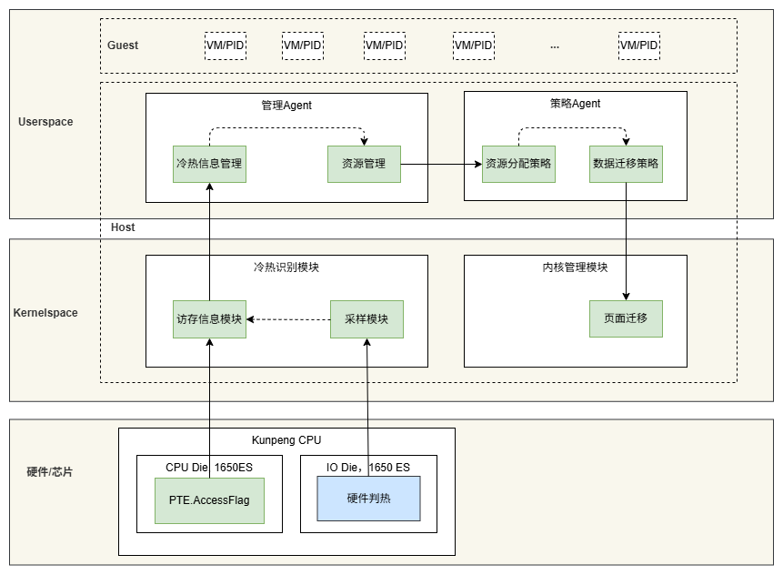
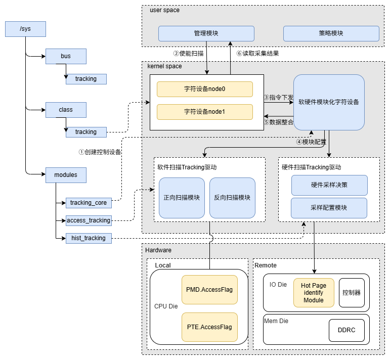
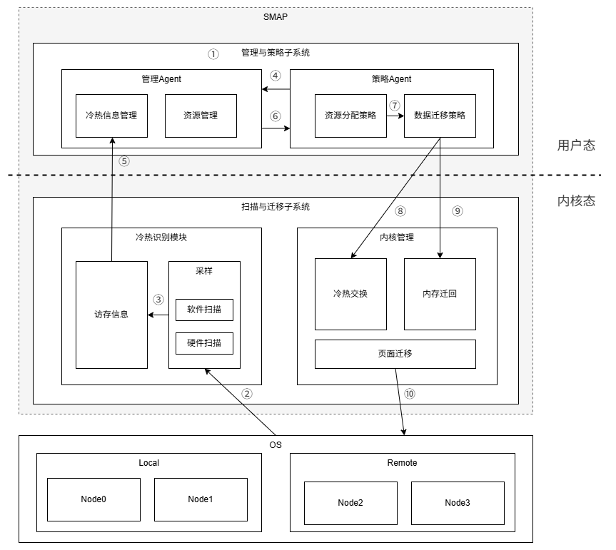
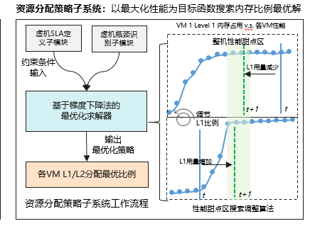

## 项目介绍

SMAP利用应用访问时空局部特征，基于芯片提供的硬件增强冷热识别能力（需具体芯片支持远端内存冷热识别功能）进行页面数据迁移，将热数据放到本地内存，将冷数据放到远端内存，端到端加速应用性能。

- 冷热数据识别，基于Linux内核页表和1650芯片硬件识别内存页的冷热。
- 内存页面迁移，主要根据页面访问次数确定需要迁移的页面并完成迁移。
- 进程资源分配，根据进程级的内存使用情况、CPU负载情况调节各进程使用借用内存的比例。

## 项目架构



主要包含以下关键技术和方案：

1. 冷热数据识别

   通过识别内存页的冷热信息，将热页迁移到近端内存中，可以从系统层面实现内存子系统在容量、时延、带宽等维度的提升。本项目通过软硬件协同设计，来提升冷热数据识别方案的可行性、可靠性、灵活性。SMAP项目研究了基于硬件的判热与判冷技术，硬件判热技术已落入1650芯片的UB union die；判冷技术当前基于Linux内核页表采用软件实现，计划落入到后续1650版本。由硬件来识别难度更高的远端内存中最热的部分页面，软件来识别统计难度较低的近端内存中最冷的部分页面。

   - 软件判冷：已知ARM CPU对于进程访问过的PTE（页表项）具有硬件自动置AF（Access Flag）位的功能，因此可通过读取PTE的AF位来获取该内存页的访问状态。
   - 硬件判热：当CPU下发访存请求时，判热模块利用统计阵列对访存页面的地址进行次数统计，从而获得页面的热度信息。由于判热模块单次扫描范围有限，为提升判热模块扫描效率，判热模块扫描前会参考使用软件扫描远端内存的结果。

   

   如上图所示，冷热数据识别相关的设备驱动创建以及工作流程如下：

   1. 初始化阶段，为了解耦核心业务层与设备层，分别创建控制字符设备和底层软硬件Tracking设备；
   2. 上层管理模块下发开始扫描命令给对应的node设备；
   3. node设备将命令下发给软硬件控制设备，该控制设备实现了用户态程序不感知软硬件具体设备；
   4. 软硬件控制设备根据配置分别使能软件扫描和硬件扫描；
   5. 软件扫描和硬件扫描完成后，控制设备按照node粒度进行整理，挂载node字符设备下；
   6. 上层管理模块从字符设备中读取扫描结果。

2. 数据迁移

   数据迁移主要由数据迁移策略模块和页面迁移模块完成，其中涉及到两个关键点：如何确定需要迁移的页面、如何设计迁移接口。数据迁移策略模块从单个进程的视角出发，根据页面访问次数和进程分配到的Local和Remote内存大小，选出Local内存中的冷页，Remote内存中的热页，然后将这些页面的物理地址和迁移目的节点传给页面迁移模块，由页面迁移模块来完成迁移动作。

   

   如上图所示，数据迁移涉及到内核态的扫描与迁移子系统、用户态的管理与策略子系统，其工作流程如下：

   1. SMAP自动识别虚机或由外部配置由SMAP管理内存的虚机
   2. 采样模块统计Local和Remote的内存页的访存次数
   3. 访存信息模块整理收集到的访存信息并提供接口给用户态
   4. 迁移周期到来时策略模块通知管理模块收集访存数据
   5. 冷热信息管理模块调用接口获取各虚机的内存页面访存数据
   6. 管理模块向策略模块返回访存数据和资源使用数据
   7. 资源分配策略模块根据各虚机的资源使用情况，决定各虚机的Local和Remote的内存资源分配
   8. 数据迁移策略模块依据各虚机的资源分配情况和访存数据识别出Local上的冷页和Remote上的热页，并向内核管理模块发送具体的迁移页面数据，进行冷热页面交换
   9. 如果有指定要迁回Remote上的内存，则向内核管理模块发送指定具体的地址段
   10. 迁移管理模块调用内核接口完成页面迁移

3. 进程资源分配

   单机内借用内存资源分配如下图所示，由三个模块共同参与完成该功能：

   1. 资源管理模块：监控节点内VM级的Footprint、冷热页面集合大小等信息，并对外提供用户态获取接口
   2. 资源分配策略模块：将借用内存在本机内VM间进行分配，对外提供VM级的近端-远端配比配置接口，以获取VM级的SLA Flavour
   3. 页面迁移模块：根据VM级的近端-远端配比目标，通过页面迁移技术达到设定的预期配比

   可选地，资源管理模块周期性的从OS层面、流水线层面去获取当前虚机CPU是否闲置、IO是否出现瓶颈等信息。使用分层的策略设计将单机内借用内存分配、VM内冷热页面互换进行解耦，并且提供per-VM的内存配比配置保持系统的灵活性和扩展性，支撑对接外部的VM级近远端内存资源配比调整。

   

## 应用适配方式

- 开启ACPI
- 执行下列命令，关闭NUMA平衡、透明大页等。

  ```shell
  echo 0 > /proc/sys/kernel/numa_balancing
  echo 0 > /proc/sys/vm/compaction_proactiveness
  echo never > /sys/kernel/mm/transparent_hugepage/defrag
  echo never > /sys/kernel/mm/transparent_hugepage/enabled
  ```

- 安装libvirt库和numactl库
- 创建ubturbo用户和用户组，安装URMA，OBMM，UBTurbo

## 如何贡献代码

### 提交代码

- fork[主仓](待补充)到你的个人仓
- 正常修改、新增代码、提交代码
- 创建合并请求到主仓的master分支

## 联系我们

针对我们的项目，在开发、使用过程中，如果有任何的意见、建议、问题，可以参考如下：

- [创建issue](待补充)
- 联系我们：待补充
