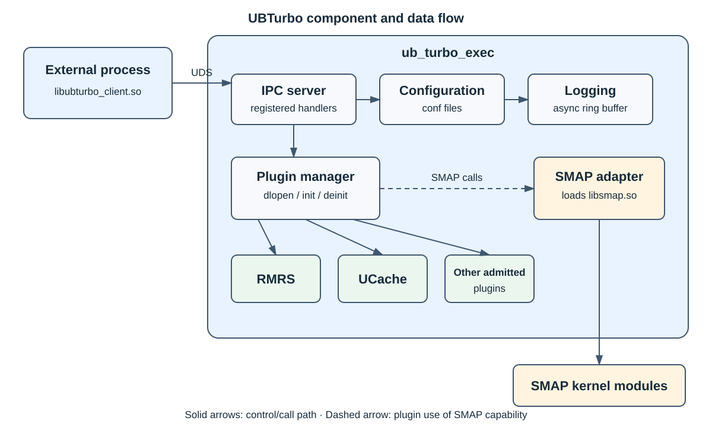

# UBTurbo

[简体中文](README.md) | [English](README_EN.md)

UBTurbo 是面向 openEuler 的节点内资源管理框架，提供配置加载、动态插件管理和 Unix
Domain Socket（UDS）通信能力，并通过 SMAP 支持多级内存的扫描与迁移。RMRS、UCache 等能力以插件
形式运行在 UBTurbo 守护进程中，按需加载。

> [!IMPORTANT]
> UBTurbo 当前仅支持 **aarch64**。SMAP、UCache 包含内核态驱动模块，编译环境须与运行环境的内核匹配。

## 核心能力

- **统一守护进程**：按固定依赖顺序初始化配置、日志、SMAP、插件和 IPC 模块。
- **插件框架**：依据准入配置通过 `dlopen` 加载插件，并调用统一的初始化、反初始化入口。
- **节点内 IPC**：客户端 SDK 通过 UDS 调用守护进程及插件注册的服务。
- **多级内存管理**：SMAP 识别页面冷热并在本地、远端 NUMA 之间迁移页面；RMRS 面向虚机和容器
  场景提供迁移决策与执行服务。
- **公共基础能力**：为主进程和插件提供配置读取与分级日志接口。

## 架构



外部进程链接 `libubturbo_client.so`，通过 UDS 调用 UBTurbo IPC 服务。守护进程中的插件管理器加载
RMRS、UCache 等动态库；SMAP 适配层加载 `libsmap.so` 并连接其用户态策略与内核扫描、迁移模块。
详细边界、启动顺序和故障行为见[架构设计](docs/architecture.md)。

## 快速开始

### 环境要求

- aarch64 服务器和 openEuler 24.03 LTS 系列环境。
- CMake 3.22 或更高版本，支持 C++17/C11 的 GCC 工具链。
- 构建 RMRS 需要 `libvirt-devel`；运行 SMAP 需要匹配当前内核的开发包和相关硬件/驱动依赖。

在 openEuler 上安装基础构建依赖：

```bash
sudo dnf install -y make gcc gcc-c++ cmake ninja-build dos2unix chrpath \
    patchelf libboundscheck libvirt-devel kernel-devel findutils git
```

### 构建

```bash
git submodule update --init --recursive
dos2unix build.sh
./build.sh
```

主要构建产物：

| 产物                     | 默认路径               | 用途                 |
| ------------------------ | ---------------------- | -------------------- |
| `ub_turbo_exec`        | `dist/release/bin/`  | UBTurbo 守护进程     |
| `libubturbo_client.so` | `dist/release/lib/`  | 客户端 SDK           |
| 配置文件                 | `dist/release/conf/` | 主进程与插件准入配置 |

运行完整服务前必须安装并加载 SMAP 所需的用户态库和内核模块。完整步骤见[安装指南](docs/installation.md)。

### 测试

```bash
./build.sh -t test
```

该命令构建并运行 UBTurbo 与 RMRS 单元测试。SMAP 测试需单独执行：

```bash
cd plugins/smap/test
sh run_dt.sh
```

覆盖率生成依赖 `lcov`，详见[开发者指南](docs/developer_guide.md)。

## 文档导航

| 文档                                        | 面向对象    | 内容                             |
| ------------------------------------------- | ----------- | -------------------------------- |
| [安装指南](docs/installation.md)             | 部署人员    | 源码、RPM、容器、SMAP 安装与验证 |
| [用户指南](docs/user_guide.md)               | 运维人员    | 配置、插件启用、服务管理和排障   |
| [配置参考](docs/configuration.md)            | 运维/开发者 | 主进程、RMRS、UCache、SMAP 配置  |
| [架构设计](docs/architecture.md)             | 开发者      | 组件边界、数据流、生命周期和约束 |
| [开发者指南](docs/developer_guide.md)        | 开发者      | SDK 调用与插件开发               |
| [API 参考](docs/api_reference.md)            | 开发者      | UBTurbo 公共接口                 |
| [实践教程](docs/tutorial.md)                 | 集成开发者  | RMRS/SMAP 端到端示例             |
| [版本说明](docs/release_notes.md)            | 所有用户    | 发布变化和已知限制               |
| [第三方组件](docs/third_party_components.md) | 合规人员    | 依赖方式与许可证入口             |

组件文档：

- [RMRS](plugins/rmrs/README.md)
- [SMAP](plugins/smap/README.md)
- [UBDMA](plugins/ubdma/docs/user_guide.md)

## 参与贡献

提交前请执行与改动范围对应的构建、测试、clang-format 和 clang-tidy 检查，并为行为变更补充测试。
提交信息沿用仓库已有的 `Feature:`、`fix:`、`doc:` 或组件名前缀风格。

## 许可证

项目许可条款见 [LICENSE](LICENSE)。不同内核组件及第三方依赖可能采用不同许可证，详见各组件的
许可证文件和[第三方组件清单](docs/third_party_components.md)。
