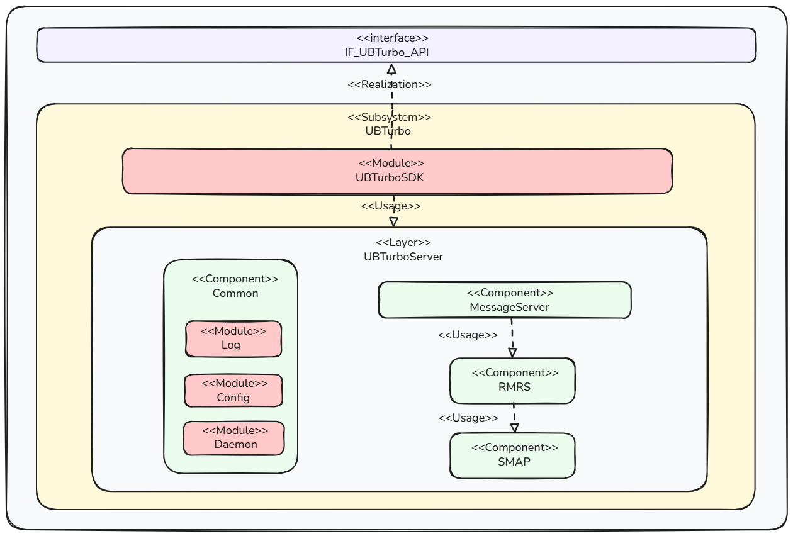

# UBTurbo

<p > 简体中文 | <a href="README_EN.md">English</a> </p>

## 项目简介

UBTurbo是一款开源的节点内资源管理框架, 具备配置读取、插件加载、日志打印和IPC通信能力，集成SMAP能力提供基础的多级内存调度服务。

例如, 在虚拟化场景中, RMRS内存迁移工具基于UBTurbo框架开发，并运行在UBTurbo进程中，通过IPC与SMAP能力对外提供内存迁移决策与执行服务，外部进程使用UBTurbo客户端向RMRS发送指令与消息流。RMRS的配置项存储在配置文件中，可以通过UBTurbo的配置读取功能获得；并且基于UBTurbo框架的日志能力打印日志。

## 目录结构

```text
UBTURBO/
├── 3rdparty                    // 源码三方库
├── build                       // 项目脚本
├── conf                        // 配置文件
├── doc                         // 文档 
├── include                     // 全局头文件
├── plugins                     // UBTurbo插件库 
├── src                         
│   ├── include                 // 头文件
│   ├── config                  // 配置模块
│   ├── ipc                     // 通信模块
│   ├── log                     // 日志模块
│   ├── main                    // UBTurbo main
│   ├── plugin                  // 插件模块
│   ├── smap                    // SMAP编/解码
│   ├── utils                   // 工具
└── test
    ├── 3rdparty                // 测试三方库
    └── testcase                // 测试用例
```

## 约束说明

- 用户使用UBTurbo进行内存借用时，需保证迁出内存地址和迁入内存地址的安全性一致。
- 用户管理的需要迁移的虚机或容器对应的用户权限应该和远端内存对应的用户权限保持一致。
- 客户使用UBTurbo，需要将用户添加到UBTurbo属组，被添加用户须拥有节点内存资源管理员的权限，才能使用UBTurbo内存迁移的能力，在内存迁移中PID由集群资源管理中心管理和下发，UBTurbo组件无法校验PID有效性，需要开发者在整体解决方案中，综合考虑pid、srcNid，destNid等参数传输和存储的安全。

## 项目架构



**UBTurbo**组件包含以下服务：

- **UBTurboSDK**：UBTurbo服务提供的SDK端，作为一个独立SDK，对外通过接口给外层模块组件使用来使用UBTurbo能力。
- **Common**：公共组件，提供一些公共能力。
  - **Log**：提供日志功能模块。
  - **Config**：配置模块，解析UBTurbo服务的配置信息。
  - **Daemon**：UBTurbo的进程，提供进程服务。
- **MessageServer**：负责接收UBTurboSDK请求，UBTurboSDK通过UDS发送请求到UBTurboServer使能加速能力。

- **RMRS**：资源腾挪，调度模块，负责虚机、容器内存资源的调度。
- **SMAP**：分级内存使能模块，通过页面扫描和迁移使能分级内存能力。

主要包含以下关键技术和方案：

1. **配置加载**：从/opt/ubturbo/conf目录下读取ubturbo.conf、ubturbo_plugin_admission.conf以及每个插件的配置文件。
2. **插件加载**：从指定目录下查找so，通过dlopen加载插件，卸载时通过dlclose关闭动态库。
3. **进程通信**：通过unix domain socket机制，进行节点内进程间通信，提供面向连接的可靠数据传输功能。使用Reactor模式，server端启动线程监听指定socket文件，接受client端连接后创建一个新线程，调用指定回调函数，将结果发送给client端。
4. **日志管理**：
   
  - 1）**异步环形缓冲区**：使用异步环形缓冲区实现异步日志记录，避免阻塞主线程；
  - 2）**锁机制**：采用适当的锁机制确保多线程环境下的线程安全性；
  - 3）**时间戳处理**：利用系统时间函数获取时间戳信息；
  - 4）**文件操作**：使用文件操作相关的API实现日志文件的写入和管理。UBTurbo框架和各插件日志独立，各自单个日志最大200MB，绕接进行记录，各自最多存储10个文件。

# 快速入门

## 前置条件

- UBTurbo集成了SMAP能力，如需使用SMAP相关能力，需提前安装SMAP. SMAP的安装方式、运行模式与单元测试运行方式详见下文[SMAP插件安装与单元测试](#SMAP插件安装与单元测试)章节，完整文档位于`plugins/smap/doc/`.

- /dev/shm/smap_config保存了NUMA和进程配置等信息，如果UBTurbo进程需要切换用户，则需要先删除该文件.

- /dev/shm/ubturbo_page_type.dat保存了SMAP的初始化类型信息，如果UBTurbo进程需要切换用户或者场景（例如虚拟化场景切换到大数据场景），则需要先删除该文件.

- UBTurbo默认不启用任何插件，请依据业务场景在ubturbo_plugin_admission.conf中打开插件（取消对应插件的注释）.

- 在ubturbo_plugin_admission.conf中打开插件前，需保证对应插件已安装且配置完成，否则UBTurbo及对应插件将启动异常.

## 构建依赖

> **架构与操作系统要求**：UBTurbo仅支持aarch64架构，构建强依赖openEuler（`CMakeLists.txt`读取`/etc/openEuler-release`），推荐在openEuler 24.03 LTS上构建。SMAP插件同样仅支持aarch64。

编译UBTurbo需要安装以下依赖（以openEuler为例）：

```bash
dnf install -y make gcc gcc-c++ cmake ninja-build dos2unix chrpath patchelf libboundscheck libvirt-devel findutils git
```

| 依赖 | 说明 | 来源 |
|-----|------|------|
| cmake >= 3.22 | 构建系统 | CMakeLists.txt |
| gcc/g++ | C/C++编译器 | ubturbo.spec |
| make | 构建工具 | ubturbo.spec |
| ninja-build | 构建加速（可选，推荐） | build.sh |
| dos2unix | 行尾格式转换 | README |
| chrpath | RPATH修改工具 | ubturbo.spec |
| patchelf | ELF二进制修改工具 | ubturbo.spec |
| libboundscheck | 安全函数库 | ubturbo.spec + 3rdparty子模块 |
| rapidjson | JSON解析库（header-only） | 3rdparty子模块 |
| libvirt-devel | 虚拟化管理开发库（RMRS插件需要） | ubturbo.spec |
| findutils | 提供`find`/`xargs`，run_ut.sh源码改写隐式依赖 | run_ut.sh |
| git | 子模块初始化与补丁应用 | README |

## UBTurbo编译

在根目录下执行:

```bash
git submodule update --init --recursive
dos2unix build.sh
sh build.sh
```

编译产物：

- 在dist/release/bin下会有以下二进制文件: `ub_turbo_exec`

- 在dist/release/lib下会有以下库文件: `libubturbo_client.so`

- 在dist/release/conf下会有以配置文件: `ubturbo_plugin_admission.conf`、`ubturbo.conf`

## 单元测试

UBTurbo使用Google Test和mockcpp框架进行单元测试。测试用例位于`test/testcase/`目录下。SMAP插件的单元测试位于`plugins/smap/test/`目录下。

### 执行单元测试

UBTurbo核心模块单元测试，在根目录下执行：

```bash
sh build.sh -t test
```

或直接运行测试脚本：

```bash
sh test/run_ut.sh
```

SMAP插件单元测试：

```bash
cd plugins/smap/test
sh run_dt.sh
```

> SMAP单元测试的依赖详见下方[SMAP单元测试](#SMAP单元测试)章节。

### 测试目标

| 测试可执行文件 | 说明 |
|-------------|------|
| ubturbo_ut | UBTurbo核心模块单元测试（config、log、ipc、plugin、smap等） |
| rmrs_ut | RMRS插件单元测试（migrate、smap_helper、ucache等） |
| smap_dt | SMAP插件单元测试（drivers、tiering、user、ucache等） |

### 代码覆盖率

`test/run_ut.sh`和`plugins/smap/test/run_dt.sh`执行测试后会通过lcov生成代码覆盖率报告。lcov需要单独安装：

```bash
# lcov不在openEuler 24.03官方仓库中，可通过源码编译安装
# 从 https://github.com/linux-test-project/lcov 获取源码
# 编译安装：make install PREFIX=/usr/local
```

> **已知兼容性问题**
> 
> - **lcov 2.3 与 gcc 12.3.1 存在 mismatched exception tag 兼容问题**，导致覆盖率收集步骤报错（脚本退出码非0，但测试本身全部通过）。`run_ut.sh` 已使用 `set +e` 包裹覆盖率收集阶段，使 lcov 报错不影响脚本退出码和 CI 结果。如需获取覆盖率报告，请使用与 gcc 12.3.1 兼容的 lcov 版本。
> - **UTC 时区导致 TestGenerateCompressedFilename 测试失败**：容器默认 UTC 时区，但日志文件名测试期望 +0800 时区。执行测试前需设置 `export TZ=Asia/Shanghai`，`run_ut.sh` 已自动设置。

## UBTurbo运行

> **运行前提**：运行 `ub_turbo_exec` 前必须先**构建并安装 SMAP**（见下方 [SMAP插件安装与单元测试](#SMAP插件安装与单元测试) 章节），包括：
> 
> 1. 构建 `libsmap.so` 用户态库并安装到 `/usr/lib64/`；
> 2. 构建 4 个内核模块（`smap_tracking_core.ko`、`smap_histogram_tracking.ko`、`smap_access_tracking.ko`、`smap_tiering.ko`）并安装到 `/lib/modules/smap/`；
> 3. 按 [SMAP安装方式](#安装RPM包) 加载内核模块（`insmod` 顺序见下文）。
>
> 若 SMAP 未安装或内核模块未加载，UBTurbo 启动时会因 Smap 模块启动失败而退出（日志：`Start module failed, name:Smap`）。若要完整运行样例可参考脚本`docker/run_verify.sh`。

- 配置ubturbo.conf，控制日志级别

| 序号 | 参数 | 说明 | 取值 | 配置节点 | 应用场景 |
|-----|-----|-----|-----|-----|-----|
| 1 | log.level | 日志等级 | 默认值：INFO，取值范围：DEBUG、INFO、WARN、ERROR、CRIT | 所有节点 | 决定主进程和插件的日志输出等级 |

- 在保持上述编译产物的相对位置的前提下，执行如下命令

```bash
chmod +x ub_turbo_exec
./ub_turbo_exec
```

# SMAP插件安装与单元测试

SMAP是UBTurbo的内部插件，源码位于`plugins/smap/`，通过页面扫描和迁移使能分级内存能力。SMAP由内核态驱动模块和用户态动态库组成，仅支持aarch64架构，支持软件扫描和硬件扫描两种冷热识别模式：软件扫描模式（`enable_hist=0`，默认）基于Linux内核页表AF位识别内存页冷热，不依赖特定硬件；硬件扫描模式（`enable_hist=1`）利用1650芯片HIST模块进行硬件判热加速，为可选增强。本章节说明SMAP的安装方式、运行模式以及单元测试的运行方式，完整文档参见`plugins/smap/doc/`。

## SMAP安装方式

### RPM包构建与安装

#### 构建RPM包

**前置依赖**

```bash
sudo dnf install -y rpm-build cmake make gcc gcc-c++ ninja-build \
    chrpath patchelf libboundscheck-devel rapidjson-devel libvirt-devel kernel-devel
```

`kernel-devel` 是构建 SMAP 内核模块的必需依赖，需确保 `/lib/modules/$(uname -r)/build` 目录存在。

**构建步骤**

1. 创建 rpmbuild 工作目录：

    ```bash
    RPMBUILD_DIR=$(mktemp -d -t ubturbo-rpmbuild-XXXXXX)
    mkdir -p "$RPMBUILD_DIR"/{SOURCES,SPECS,RPMS,SRPMS,BUILD,BUILDROOT}
    ```

2. 构建 ubturbo-rmrs RPM（打包 UBTurbo 源码并执行 rpmbuild）：

    ```bash
    cd <SOURCE_DIR>
    tar -czf "$RPMBUILD_DIR/SOURCES/ubturbo.tar.gz" \
        --exclude='.git' --exclude='.gitignore' --exclude='.gitmodules' \
        --exclude='dist' --exclude='output' --exclude='*.tar.gz' --exclude='*.rpm' .
    cp ubturbo.spec "$RPMBUILD_DIR/SPECS/"
    rpmbuild -ba "$RPMBUILD_DIR/SPECS/ubturbo.spec" \
        --define "_topdir $RPMBUILD_DIR" \
        --define "_sourcedir $RPMBUILD_DIR/SOURCES" \
        --define "ubturbo_version 1.1.1" \
        --define "release_version 1"
    ```

3. 构建 ubturbo-smap RPM（打包 `plugins/smap/` 源码并执行 rpmbuild，传入 `KERNEL_VERSION` 宏）：

    ```bash
    cd <SOURCE_DIR>/plugins
    tar -czf "$RPMBUILD_DIR/SOURCES/smap.tar.gz" \
        --exclude='.git' --exclude='build' --exclude='output' \
        --exclude='smap/CMakeCache.txt' --exclude='smap/CMakeFiles' smap
    cp smap/smap.spec "$RPMBUILD_DIR/SPECS/"
    rpmbuild -ba "$RPMBUILD_DIR/SPECS/smap.spec" \
        --define "_topdir $RPMBUILD_DIR" \
        --define "_sourcedir $RPMBUILD_DIR/SOURCES" \
        --define "KERNEL_VERSION <openeuler|ocos|velinux>" \
        --define "smap_version 1.0.0" \
        --define "release_version 1"
    ```

    `KERNEL_VERSION` 默认 `openeuler`，可选值：`openeuler` | `ocos` | `velinux`。

4. 收集 RPM 产物到输出目录：

    ```bash
    mkdir -p <OUTPUT_DIR>
    cp "$RPMBUILD_DIR"/RPMS/*/*.rpm <OUTPUT_DIR>/
    cp "$RPMBUILD_DIR"/SRPMS/*.rpm <OUTPUT_DIR>/
    rm -rf "$RPMBUILD_DIR"
    ```

**构建产物**

- `ubturbo-rmrs-*.aarch64.rpm`：UBTurbo 主框架
- `ubturbo-smap-*.aarch64.rpm`：SMAP 内核驱动与用户态库

#### 安装RPM包

1. 安装SMAP软件包（包名`ubturbo-smap`）：

    ```bash
    rpm -ivh ubturbo-smap-x.x.x-x.oe2403sp1.aarch64.rpm
    ```

    RPM安装会自动部署以下文件：
    - 内核模块：`/lib/modules/smap/`（smap_tracking_core.ko、smap_access_tracking.ko、smap_histogram_tracking.ko、smap_tiering.ko）
    - 用户态库：`/usr/lib64/libsmap.so`

2. 加载内核模块（按顺序，顺序有依赖，不可调整）：

    ```bash
    cd /lib/modules/smap
    insmod smap_tracking_core.ko
    insmod smap_histogram_tracking.ko                        # 必需，smap_access_tracking 依赖它
    insmod smap_access_tracking.ko                           # 使能硬件判热时传 enable_hist=1，可不传
    insmod smap_tiering.ko smap_pgsize=1                     # smap_pgsize: 1=2M模式(虚拟化), 0=4K模式(容器)
    ```

3. 启动 ubturbo 服务：

    ```bash
    systemctl start ubturbo
    ```

4. 等待 IPC socket 就绪（检测 `/opt/ubturbo/ubturbo_ipc`，最多等待30秒）：

    ```bash
    for i in $(seq 1 30); do
        [[ -S /opt/ubturbo/ubturbo_ipc ]] && break
        sleep 1
    done
    ```

5. 调用 SMAP 初始化（`page_type`: `1`=2M模式，`0`=4K模式）：

    ```bash
    python3 smap_ipc.py start <page_type>
    ```

6. 验证模块加载成功：

    ```bash
    lsmod | grep -E "tracking|smap"
    ```

## SMAP运行模式

SMAP运行模式由用户态接口`ubturbo_smap_start(pageType)`的入参控制，与ko加载解耦，切换模式无需重插ko：

| pageType | 模式 | 适用场景 |
|----------|------|---------|
| 0 | 4K模式 | 容器场景 |
| 1 | 2M模式 | 虚拟化场景 |

运行前提条件：

- 开启ACPI
- 关闭NUMA平衡与透明大页：
  
    ```bash
    echo 0 > /proc/sys/kernel/numa_balancing
    echo 0 > /proc/sys/vm/compaction_proactiveness
    echo never > /sys/kernel/mm/transparent_hugepage/defrag
    echo never > /sys/kernel/mm/transparent_hugepage/enabled
    ```

- 提前安装URMA、libvirt、numactl
- 创建ubturbo用户和用户组

典型调用流程（通过`libsmap.so`提供的`smap_interface.h`接口）：
`ubturbo_smap_start` → `ubturbo_smap_remote_numa_info_set` → `ubturbo_smap_migrate_out` → （周期扫描迁移） → `ubturbo_smap_migrate_out`(ratio=0) → `ubturbo_smap_remove`

## SMAP单元测试

### 执行单元测试

```bash
cd plugins/smap/test
sh run_dt.sh
```

### 单元测试依赖

| 依赖 | 说明 | 安装方式 |
|------|------|---------|
| findutils | 提供`find`/`xargs`，run_dt.sh源码改写的隐式依赖 | `dnf install -y findutils` |
| cmake >= 3.13 | 构建系统 | `dnf install -y cmake` |
| make / gcc / gcc-c++ | 编译工具（含gcov） | `dnf install -y make gcc gcc-c++` |
| dos2unix | 行尾格式转换 | `dnf install -y dos2unix` |
| git | 应用mockcpp补丁 | `dnf install -y git` |
| mockcpp / googletest | 测试框架（子模块） | `git submodule update --init --recursive` |
| perl | lcov运行依赖 | `dnf install -y perl` |
| perl-Capture-Tiny | lcov运行依赖 | `dnf install -y perl-Capture-Tiny` |
| perl-DateTime | lcov运行依赖 | `dnf install -y perl-DateTime` |
| lcov / genhtml | 覆盖率报告 | 源码安装 |

# 说明 

此开源项目非华为产品，仅提供有限支持。
