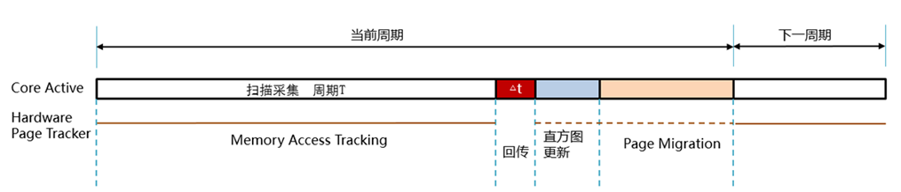
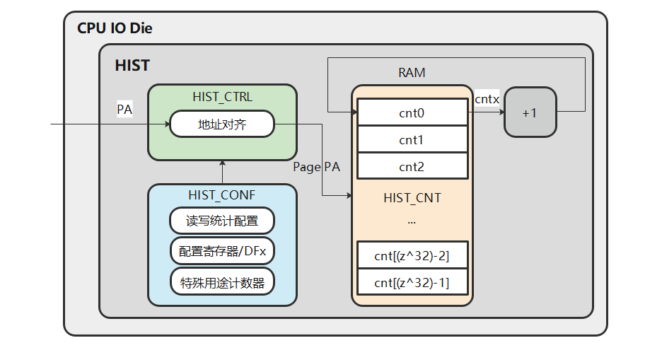

# Summary

在灵衢超节点架构中，通过内存池化技术，单个节点可以利用其它节点的内存资源，SMAP可以根据节点上虚机或容器的内存使用情况对动态分配应用内存，实现内存池资源的充分利用并保障应用性能：

- 提供冷热数据识别，内存页面迁移，进程资源分配的功能
- 面向灵衢架构的通算虚拟化场景
- 是UBTurbo中的一个组件，依赖OBMM

# Usage Example

- [API文档](./api_docs_reference.md)

## Compilation

SMAP编译需要环境上安装有openEuler 6.6.0-86.0.0.90.oe2403sp1.aarch64内核的kernel-devel包，进入项目根目录执行下列命令来编译内核模块：

```shell
make -C src/drivers -j
cp src/drivers/Module.symvers src/tiering/depends
make -C src/tiering -j
```

编译成功后会生成以下文件:

- src/drivers/smap_access_tracking.ko
- src/drivers/smap_histogram_tracking.ko
- src/drivers/smap_tracking_core.ko
- src/tiering/smap_tiering.ko

SMAP用户态代码编译有以下依赖：

1. 需要编译环境能够下载.gitmodules中的代码仓
2. 需要环境上安装有libboundscheck安全库

在项目根目录下执行下列命令来编译动态库:

```shell
dos2unix build.sh
sh build.sh
```

编译成功后会生成以下文件:

- output/smap/lib/libsmap.so

## Installation

SMAP的运行模式根据进程的页面大小, 分为4K模式和2M模式, 通过在插入ko时传参来控制, 若需要切换模式, 需要重插ko。smap_histogram_tracking.ko依赖硬件, 按实际需求插入。下面列举了不同模式的安装命令：

- 4K Mode (容器模式)

    ```shell
    insmod src/drivers/smap_tracking_core.ko
    insmod src/drivers/smap_histogram_tracking.ko
    insmod src/drivers/smap_access_tracking.ko smap_scene=2
    insmod src/tiering/smap_tiering.ko smap_scene=2 smap_pgsize=0
    ```

- 2M Mode (虚机模式)

    ```shell
    insmod src/drivers/smap_tracking_core.ko
    insmod src/drivers/smap_histogram_tracking.ko
    insmod src/drivers/smap_access_tracking.ko smap_scene=2
    insmod src/tiering/smap_tiering.ko smap_scene=2
    ```

卸载时按以下顺序卸载，卸载前需要先停止UBTurbo服务或其它使用SMAP的进程：

```shell
rmmod smap_tiering
rmmod smap_access_tracking
rmmod smap_histogram_tracking
rmmod smap_tracking_core
```

# Motivation

SMAP包含冷热数据识别、数据迁移与进程资源分配三个关键能力，用户态实现数据迁移策略和进程资源分配策略，内核态实现访存信息采样和页面迁移。

# Detailed Design

SMAP在运行时会依次进行数据采集、冷热识别和页面迁移，一个完整的运行周期如下图所示：



1. 冷热数据识别
    通过识别内存页的冷热信息，将热页迁移到近端内存中，可以从系统层面实现内存子系统在容量、时延、带宽等维度的提升。本项目通过软硬件协同设计，来提升冷热数据识别方案的可行性、可靠性、灵活性。SMAP项目研究了基于硬件的判热与判冷技术，硬件判热技术已落入1650芯片的UB union die；判冷技术当前基于Linux内核页表采用软件实现，计划落入到后续1650版本。由硬件来识别难度更高的远端内存中最热的部分页面，软件来识别统计难度较低的近端内存中最冷的部分页面。
   - 软件判冷：已知ARM CPU对于进程访问过的PTE（页表项）具有硬件自动置AF（Access Flag）位的功能，因此可通过读取PTE的AF位来获取该内存页的访问状态。

    

   - 硬件判热方案：HIST阵列判热模块可用于统计单位时间内任意连续8k个页面的访存计数值（2M页时可覆盖16GB内存）。当CPU下发访存请求时，HIST阵列判热模块利用统计阵列对局部访存页面地址次数进行统计，得到页面的热度信息，然后通过中断或Polling等方式进行统计信息上报。相对于软件扫描的单比特冷热信息，阵列判热模块的扫描结果对冷热页更具有区分度。阵列判热模块被配置后，当硬件扫描结束后，通过API读取扫描结果，读取完后统计计数自动清零。

    

2. 数据迁移
    数据迁移主要由数据迁移策略模块和页面迁移模块完成，其中涉及到两个关键点：如何确定需要迁移的页面、如何设计迁移接口。数据迁移策略模块从单个进程的视角出发，根据页面访问次数和进程分配到的Local和Remote内存大小，选出Local内存中的冷页，Remote内存中的热页，然后将这些页面的物理地址和迁移目的节点传给页面迁移模块，由页面迁移模块来完成迁移动作。下图展示了确定Local和Remote内存上的访存次数临界点的方法：
   1. 确定最大迁移量migrateNum，该值为各级内存中空闲物理页的量、应用当前使用各级内存物理页的量或应用在慢内存上热页数量这三类值中的最小值；
   2. 快内存中的物理页基于频次升序排序，靠前的为冷页，慢内存中的物理页降序排序，靠前的为热页；
   3. 基于二分法快速查找临界点索引，二分法判断条件为：快内存中物理页的频次小于等于慢内存中物理页的频次+阈值，或快内存中物理页的频次为0且慢内存中物理页的频次不为0； 根据确定的临界点，将所有频次低于临界点的快内存上的物理页以及所有频次高于临界点的慢内存上的物理页进行交换。

    

3. 自适应迁移算法
   冷热排序算法依赖扫描和迁移物理页。扫描与迁移行为会引入不小的开销，因此需要能够对扫描周期和迁移周期自适应调整。自适应迁移参数算法根据不同的场景选择不同的扫描周期与迁移周期。根据实际测试结果，典型业务场景可以通过热区特征来进行划分，根据其热区的大小以及热区的变化程度被归类为三种特征场景：非稳态，稳态重载，稳态轻载。
   - 非稳态场景：热区的大小以及热区的形状不稳定，前者指热页数量上的变化，后者指相邻迁移周期的热区重合度；
   - 稳态场景：热区大小和热区形状稳定的场景，根据热区大小可进一步分类为轻载和重载。 非稳态场景的热区存在变化，因此其时间局部性弱，需要更高的扫描和迁移频率提高迁移的及时性。 稳态场景需要降低迁移和扫描的频率以降低其开销。

    其状态转换图如下所示：

    

4. 进程资源分配
    不同应用场景对于近端内存比例的需求不同。应用的workingset通常表现为阶梯形状，在台阶的平台部分调节远近端内存比例，应用的性能基本不受影响。因此，可在性能不变的情况下，实现快内存的最大化资源利用。

    

    如图，128G虚机处于台阶的平台区，但是32G虚机处于台阶的拐点，将128G虚机的适量快内存借给32G虚机，可在128G虚机性能不变的情况下提升32G虚机的性能。多进程自适应调度算法包括两部分：
    1. 计算虚机满足性能需求的本地内存比例： 虚机的访存性能取决于有多少比例的数据在时延较小的本地内存上命中。对于热区稳定的负载，调整虚机本地内存比例略大于热页数量，结合冷热迁移，能够使几乎全部的热页都在近端内存上命中，来达成性能需求；对于热区不稳定的负载，则提高本地内存的比例到合适比例。
    2. 重新调节虚机的本地内存比例： 每台虚机根据不同使用场景，具有不同的初始迁出比例。首先统计同NUMA下的虚机的本地内存页面总数。根据1中计算的满足性能需求的本地内存比例，可判断得到当前虚机为可借出状态或需要借入状态。可借出状态的虚机将借出本地大页给其它虚机。

## Project Structure

SMAP的主要文件有：

```plaintext
SMAP/
├── 3rdparty /                    # 第三方库目录
├── cmake/                        # cmake脚本目录
├── doc/                          # 文档目录
│   ├── api_docs_reference.md     # API接口文档
│   ├── Design_docs_Reference.md  # 设计文档
├── README.md                     # README
├── smap.spec                     # SPEC文件
├── src/                          # 源代码目录
│   ├── drivers/                  # 内核态扫描模块代码
│   ├── tiering/                  # 内核态迁移模块代码
│   └── user/                     # 用户态代码
└── test/                         # 测试代码
```

# Design constraints

SMAP使用有以下约束或限制：

- 需要服务器使用灵衢架构，依赖OBMM
- 只支持管理使用2M静态大页的虚机或使用4K页面的进程

# Adoption strategy

- 应用无需做特殊更改

# Related Documentions

无

# SIGs/Maintianers

待补充
