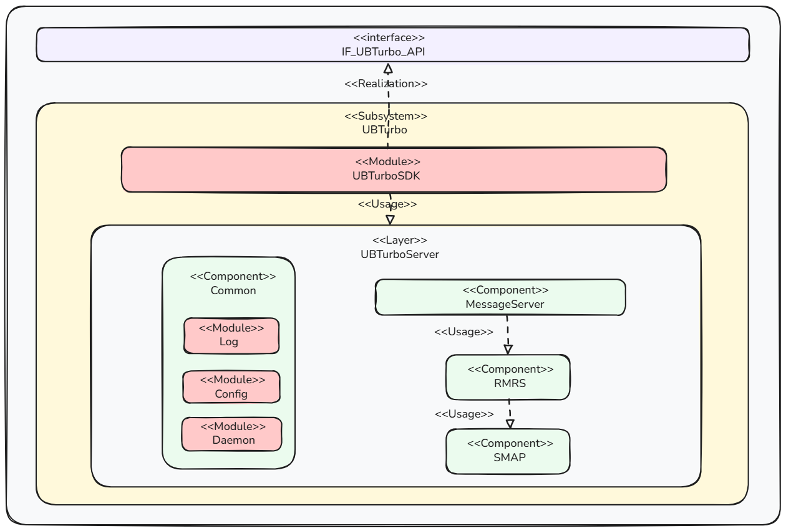

# Summary

UBTurbo是一款开源的节点内资源管理框架, 具备配置读取、插件加载、日志打印和IPC通信能力，集成SMAP能力提供基础的多级内存调度服务。

例如, 在虚拟化场景中, RMRS内存迁移工具基于UBTurbo框架开发，并运行在UBTurbo进程中，通过IPC与SMAP能力对外提供内存迁移决策与执行服务，外部进程使用UBTurbo客户端向RMRS发送指令与消息流。RMRS的配置项存储在配置文件中，可以通过UBTurbo的配置读取功能获得；并且基于UBTurbo框架的日志能力打印日志。

- 提供插件加载与管理功能
- 提供IPC通信接口
- 底层封装SMAP多级内存调度能力

# Usage Example

- [API文档](./docapi_docs_reference.md)
- [用户指南](./User_Guide.md)

# Motivation

UBTurbo是一款Huawei计算产品线自研、开源的节点内资源管理框架, 具备配置读取、插件加载、日志打印和IPC通信能力，集成SMAP能力提供基础的多级内存调度服务。

# Detailed Design

**OS Turbo**组件包含以下服务：

- **UBTurboSDK**：UBTurbo服务提供的SDK端，作为一个独立SDK，对外通过接口给外层模块组件使用来使用UBTurbo能力。
- **Common**：公共组件，提供一些公共能力。
  - **Log**：提供日志功能模块。
  - **Config**：配置模块，解析UBTurbo服务的配置信息。
  - **Daemon**：UBTurbo的进程，提供进程服务。
- **MessageServer**：负责接收并处理UBTurboSDK通过UDS发送的请求。

- ***RMRS***：资源腾挪，调度模块，负责虚机、容器内存资源的调度。
- ***SMAP***：分级内存使能模块，通过页面扫描和迁移使能分级内存能力。

具体的，主要包含以下关键技术和方案：

1. 配置加载：读取UBTurbo进程以及每个插件的配置文件。
2. 插件加载：从指定目录下查找so，通过dlopen加载插件，卸载时通过dlclose关闭动态库。
3. 进程通信：通过unix domain socket机制，进行节点内进程间通信，提供面向连接的可靠数据传输功能。使用Reactor模式，server端启动线程监听指定socket文件，接受client端连接后创建一个新线程，调用指定回调函数，将结果发送给client端。
4. 日志管理：
   1）异步环形缓冲区：使用异步环形缓冲区实现异步日志记录，避免阻塞主线程；
     2）锁机制：采用适当的锁机制确保多线程环境下的线程安全性；
     3）时间戳处理：利用系统时间函数获取时间戳信息；
     4）文件操作：使用文件操作相关的API实现日志文件的写入和管理。OS Turbo框架和各插件日志独立，各自单个日志最大200MB，绕接进行记录，各自最多存储10个文件。

# Design constraints

- 用户使用UBTurbo进行内存借用时，需保证迁出内存地址和迁入内存地址的安全性一致。
- 用户管理的需要迁移的虚机或容器对应的用户权限应该和远端内存对应的用户权限保持一致。
- 客户使用UBTurbo，需要将用户添加到UBTurbo属组，被添加用户须拥有节点内存资源管理员的权限，才能使用UBTurbo内存迁移的能力，在内存迁移中PID由集群资源管理中心管理和下发，UBTurbo组件无法校验PID有效性，需要开发者在整体解决方案中，综合考虑pid、srcNid，destNid等参数传输和存储的安全。

# Adoption strategy

- 应用无需做特殊更改

# Related Documentions

无

# SIGs/Maintianers

待补充