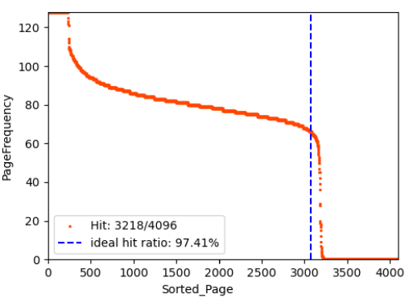
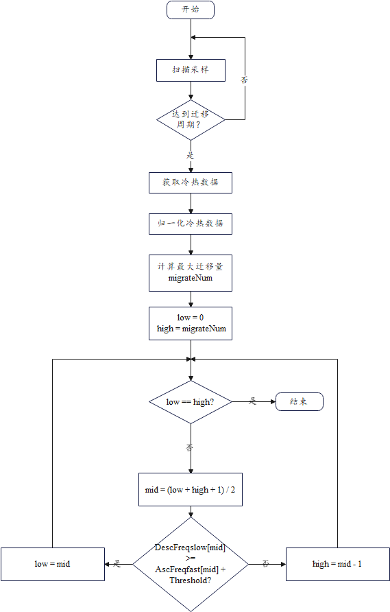
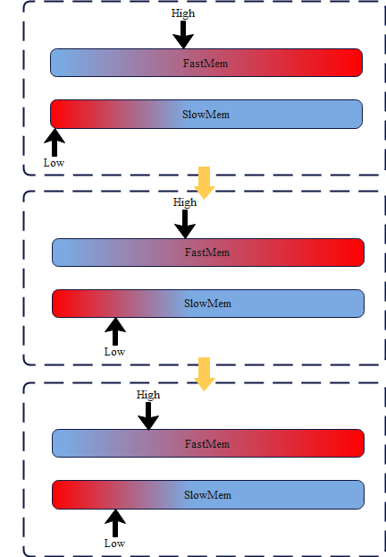
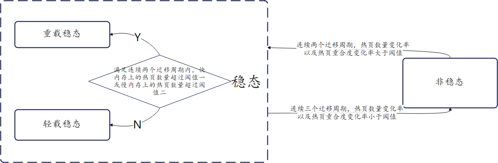
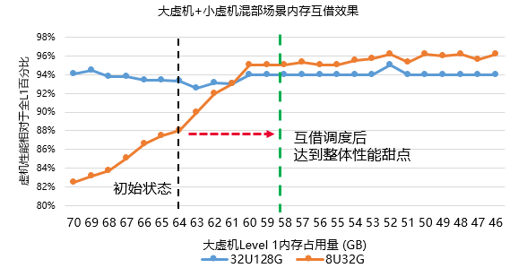
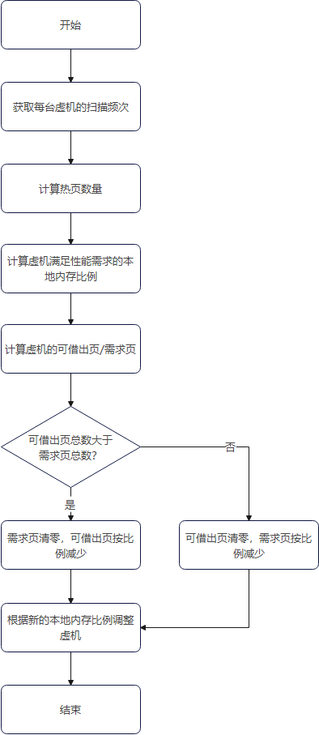
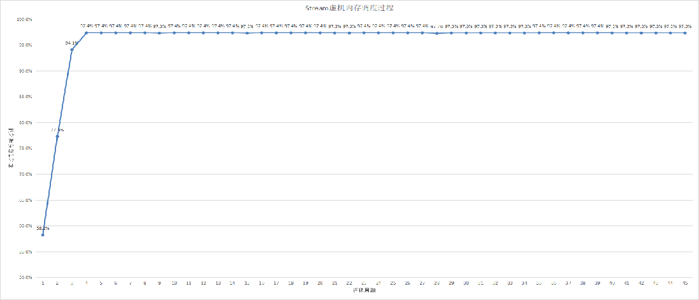
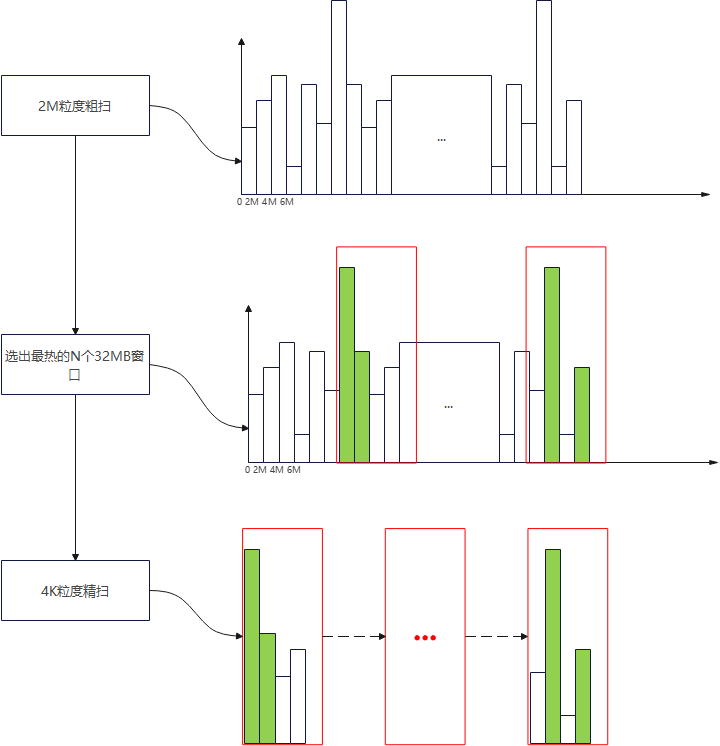
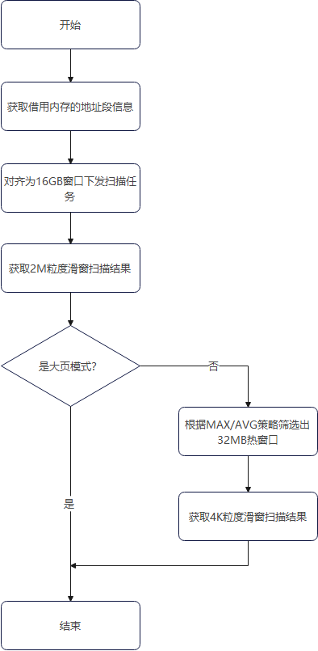

# **SMAP性能算法设计**

## 冷热排序算法

### 算法思路
冷热排序算法通过对物理页采样实现冷热分级。根据不同业务，采样粒度可分为2M大页与4K小页。该算法通过扫描周期与迁移周期控制采样精度，一个迁移周期内包含多个扫描周期。扫描周期越短则获取的频次越高，越接近系统对该物理页发起访问的真实次数。通过累加一个迁移周期中的多次扫描结果，可获取系统对扫描范围内物理页的访问频次分布的采样结果。

当到达迁移周期时，该算法对不同等级内存（下面用快内存和慢内存描述）的频次采样结果进行排序。由于快内存和慢内存的冷热数据的扫描方式可能不同，扫描精度也不相同，因此，需要对排序的冷热数据进行归一化处理。对于归一化处理后的结果按照二分法搜索冷热数据交换的临界点。临界点的确定方法如下：
 1. 确定最大迁移量migrateNum，该值为各级内存中空闲物理页的量、应用当前使用各级内存物理页的量或应用在慢内存上热页数量这三类值中的最小值；
 2. 快内存中的物理页基于频次升序排序，靠前的为冷页，慢内存中的物理页降序排序，靠前的为热页；
 3. 基于二分法快速查找临界点索引，二分法判断条件为：快内存中物理页的频次小于等于慢内存中物理页的频次+阈值，或快内存中物理页的频次为0且慢内存中物理页的频次不为0；
根据确定的临界点，将所有频次低于临界点的快内存上的物理页以及所有频次高于临界点的慢内存上的物理页进行交换。

### 实现流程

该算法的每个周期执行流程如下图所示：

其中临界点的寻找过程如下图所示：

### 性能测试

#### 评价指标

冷热排序算法的目的是实现快内存上的冷页与慢内存上的热页进行交换。因此，评价指标可设置为快内存上的访问频次数量占总频次的百分比，来量化该算法的冷热交换效果。

#### 测试结果

## 自适应迁移参数算法

### 算法思路

冷热排序算法依赖扫描和迁移物理页。扫描与迁移行为会引入不小的开销，因此需要能够对扫描周期和迁移周期自适应调整。自适应迁移参数算法根据不同的场景选择不同的扫描周期与迁移周期。根据实际测试结果，典型业务场景可以通过热区特征来进行划分，根据其热区的大小以及热区的变化程度被归类为三种特征场景：非稳态，稳态重载，稳态轻载。
 - 非稳态场景：热区的大小以及热区的形状不稳定，前者指热页数量上的变化，后者指相邻迁移周期的热区重合度；
 - 稳态场景：热区大小和热区形状稳定的场景，根据热区大小可进一步分类为轻载和重载。
非稳态场景的热区存在变化，因此其时间局部性弱，需要更高的扫描和迁移频率提高迁移的及时性。
稳态场景需要降低迁移和扫描的频率以降低其开销。

### 实现流程

该算法基于每个迁移周期的冷热数据信息识别应用的热区特征，当判断需要切换场景时，调整其扫描和迁移参数至对应值。该过程可以用如下状态转换图表示：

### 性能测试

#### 评价指标
该算法通过调整不同的扫描和迁移参数以适应不同场景下的性能需求，因此可评估典型场景下自适应参数与固定参数的性能差异。

#### 测试结果

## 多进程自适应调度算法

### 算法思路

不同应用场景对于近端内存比例的需求不同。应用的workingset通常表现为阶梯形状，在台阶的平台部分调节远近端内存比例，应用的性能基本不受影响。因此，可在性能不变的情况下，实现快内存的最大化资源利用。

如图，128G虚机处于台阶的平台区，但是32G虚机处于台阶的拐点，将128G虚机的适量快内存借给32G虚机，可在128G虚机性能不变的情况下提升32G虚机的性能。

多进程自适应调度算法包括两部分：
1. 计算虚机满足性能需求的本地内存比例：
虚机的访存性能取决于有多少比例的数据在时延较小的本地内存上命中。对于热区稳定的负载，调整虚机本地内存比例略大于热页数量，结合冷热迁移，能够使几乎全部的热页都在近端内存上命中，来达成性能需求；对于热区不稳定的负载，则提高本地内存的比例到合适比例。
2. 重新调节虚机的本地内存比例：
每台虚机根据不同使用场景，具有不同的初始迁出比例。首先统计同NUMA下的虚机的本地内存页面总数。根据1中计算的满足性能需求的本地内存比例，可判断得到当前虚机为可借出状态或需要借入状态。可借出状态的虚机将借出本地大页给其它虚机。

### 实现流程

自适应调度算法流程如图：

其中，计算虚机满足性能需求的本地内存比例，其计算方式为：

Page_guarantee = Pages_hot * β

其中，Page_guarantee为该虚机需要的本地内存页面数量（简称保障页），Pages_hot为该虚机的热页数量，β=1.05为一个比例系数。对于热区稳定的应用，虚机的Pages_hot数值稳定，因此取略大于热页数量的值作为保障页的数量。对于热区不稳定的应用，引入负反馈机制：当远端内存上有访问时，保障页数量额外增加。在负反馈机制下，保障页的数量会逐渐增加，直到消除远端内存上的访问。负反馈机制下，保障页的计算方式为：

Page_guarantee_max = MAX(Page_guarantee, 5) 

Page_guarantee = Page_guarantee_max + Pages_hot_remote * β

其中，Page_guarantee_max表示历史5个周期中计算出的最大的保障页数量，Pages_hot_remote为该虚机当前周期中远端内存上的热页数量。

### 性能测试

#### 评价指标

在同NUMA下启动多台虚机，执行不同的业务负载以构造混部场景。以不使用调度算法作为基线，使用调度算法作为对照组，以每台虚机的对照组性能与基线性能的百分比累加值作为评价指标。预期重载场景虚机在自适应调度后性能得到提高，轻载场景虚机在自适应调度后性能不下降，最终整体性能得到提高。

#### 测试结果

1650 UB环境启动两台4U8G虚机，一台跑stream，一台空载，Stream虚机的本地内存调度如下：计算出热页比例为92.7%，略多分配后，stream虚机的本地内存比例被设置为97.4%。

## 硬件判热滑窗算法

### 算法思路

在1650 UB-C代际，芯片支持SMAP.HIST判热方案：免TLB Invalidate，由硬件完成扫描和数据上报。该HIST模块具有以下特性：
1. 支持对连续8K个页表的PA地址操作分别进行统计。其中，页表大小可配置为4KB或2MB，对应统计的连续空间分别为32MB或16GB，统计区间的起始地址分别按照32MB或16GB对齐；
2. 统计表项规格：8K个统计值，每个统计值位宽为16bit，计满时保持，被读时自动清零；
3. 支持软件配置使能和关闭，使能后开始统计，关闭后停止统计；
4. 每个socket下有两个BA模块，分别统计不同的远端内存地址段。
硬件扫描的优势在于可以持续扫描一段区间的页，其16bit访存计数器可以帮助很好地区分热页。但是，由于只有8k个计数器，硬件扫描一次最多只能覆盖16GB（设置为2M统计粒度时可覆盖16GB，设置为4K粒度时仅可覆盖32MB）的连续内存地址。因此，需要通过4K/2M粒度的恰当切换，实现对目标地址段的快速扫描，同时，获取的访存结果需要尽可能逼近真实的访存统计。
1. 面向2M大页场景，恒定设置硬件模块的统计粒度为2M，通过滑窗采样的方式对远端内存的物理地址持续扫描，具体流程如下：按照升序的物理地址顺序，将内存划分为多个16GB地址对齐的区间；依次遍历16GB区间，记录扫描统计值；扫描完成后整理为全局访存统计结果。
2. 面向4K页场景，滑窗采样的窗口数量将增大512倍，为了提升硬件模块的扫描效率，会采取多粒度滑窗采样策略，具体流程如下：
1）初始配置：硬件扫描粒度初始设置为2M
2）区间分段：按照升序的物理地址顺序，将内存划分为多个16GB地址对齐的区间
3）筛选热区间：依次遍历16GB区间进行粗扫，记录所有2M粒度区间的扫描统计值，选中最热的N个32MB地址对齐的窗口；
4）切换硬件扫描粒度为4K，依次遍历扫描热区间窗口，扫描完成后整理为全局访存统计结果。

### 实现流程

滑窗算法的流程如图：

其中，根据MAX/AVG策略筛选出32MB热窗口，其中，MAX策略指对每个32MB窗口的16个统计值取最大值，并基于最大值进行热度排序；AVG策略指对16个统计值求平均值，基于平均值进行热度排序。筛选出的热窗口数量设置为10%的总窗口数量，从而将4K下滑窗扫描的原本开销下降10倍。

### 性能测试

#### 评价指标

#### 测试结果

