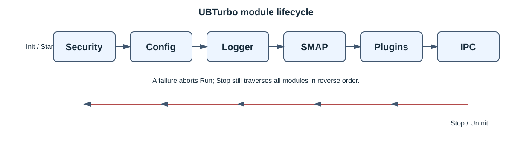

# UBTurbo 架构设计

## 设计目标

UBTurbo 为同一节点上的资源管理能力提供统一进程、插件生命周期、配置、日志和 IPC 基础设施。框架
本身不负责集群调度，也不判断业务侧下发 PID 的归属；这些信息属于上层资源管理系统的信任边界。

## 系统边界

| 组件 | 进程位置 | 职责 |
| --- | --- | --- |
| 客户端 SDK | 外部业务进程 | 序列化请求并通过 UDS 调用服务 |
| `TurboMain` | `ub_turbo_exec` | 编排模块初始化、启动、停止和反初始化 |
| Config | 守护进程 | 解析主配置、插件准入配置和插件配置 |
| Logger | 守护进程 | 提供异步、分级、按模块输出的日志能力 |
| SMAP adapter | 守护进程 | 动态加载 `libsmap.so`，注册 SMAP IPC handler |
| Plugin manager | 守护进程 | 加载准入的共享库并调用插件生命周期入口 |
| IPC server | 守护进程 | 监听 UDS，分发已注册服务并返回结果 |
| RMRS/UCache | 守护进程插件 | 提供具体资源管理策略和服务 |
| SMAP kernel modules | 内核 | 页面扫描、访问统计和迁移执行 |

SMAP 在主进程中由专用模块集成，不经过通用插件准入配置。RMRS 和 UCache 才是由插件管理器加载的
动态插件。UBDMA 是面向远端内存复制的数据通路组件，不是 UBTurbo IPC 服务链上的必经模块。

## 生命周期

`src/main/turbo_main.cpp` 中的 `g_modules` 是顺序的唯一事实来源：

1. Config
2. Logger
3. SMAP
4. Plugin
5. IPC

每个模块先执行 `Init()`，随后执行 `Start()`；收到 `SIGINT`、`SIGTERM` 或 `SIGHUP` 后，按相反
顺序执行 `Stop()` 和 `UnInit()`。`SIGPIPE` 被记录并忽略。

当前实现中，初始化或启动失败会立即从 `Run()` 返回；`main()` 随后调用一次全局 `Stop()`。
各模块的停止函数必须能容忍尚未完整启动的状态。

## 插件模型

插件准入配置将插件名映射为模块码。配置管理器再读取插件自身配置中的共享库名称。插件管理器：

1. 使用 `dlopen` 加载共享库。
2. 使用 `dlsym` 获取 `TurboPluginInit`。
3. 传入模块码执行初始化。
4. 退出时调用可选的 `TurboPluginDeInit`，随后 `dlclose`。

插件通过 `UBTurboRegIpcService` 注册回调，通过 UBTurbo 日志宏记录日志。当前插件管理器遇到单个
插件 `dlopen`、符号解析或初始化失败时会记录错误并跳过该插件，随后继续启动；因此必须通过日志和
服务探测确认所需插件确已加载。准入配置自身无法读取等更早阶段的错误仍可能阻断启动。

## IPC 数据流

1. 客户端构造 `TurboByteBuffer` 并调用 `UBTurboFunctionCaller`。
2. SDK 连接本机 UDS，将服务名和请求数据发送给守护进程。
3. IPC server 查找注册的 `IpcHandlerFunc`。
4. handler 处理请求并填充输出缓冲区。
5. IPC server 将返回码与输出发送给客户端。

IPC 是节点内通信机制，不提供跨节点认证、授权或加密。调用方身份和参数来源必须由部署方案保证。

## 配置与日志

安装包默认将运行文件部署到 `/opt/ubturbo`。主配置控制日志级别，插件准入配置决定加载哪些插件，
插件配置提供共享库名称及业务参数。详细键值见[配置参考](configuration.md)。

日志按模块分开管理，写入前应避免包含凭证、敏感地址或个人信息。文件权限与通信矩阵见
[安全说明](security.md)。

## 设计约束

- 仅支持 aarch64 openEuler；CMake 配置阶段读取 `/etc/openEuler-release`。
- SMAP 用户态库、内核模块、内核开发包和运行内核必须配套。
- UBTurbo 只管理节点内能力，不代替上层集群资源管理器。
- 公共 API 使用 C++ 类型，即使部分函数以 `extern "C"` 导出，也不能据此视为纯 C ABI。

## 相关文档

- [开发者指南](developer_guide.md)
- [API 参考](api_reference.md)
- [RMRS](rmrs/README.md)
- [SMAP](smap/README.md)
- [UBDMA](ubdma/README.md)
