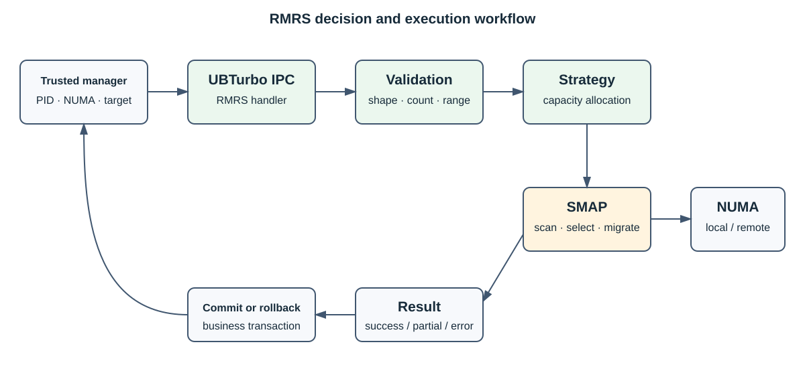

# RMRS

[简体中文](README.md) | [English](README_EN.md)

RMRS is a resource migration and scheduling plugin that runs in the UBTurbo daemon. For virtual-machine and
container workloads, it calculates migration plans from requests, NUMA capacity, and page-access information, then
uses SMAP to migrate out, migrate back, or roll back memory.

RMRS does not move physical pages itself and does not authorize caller-supplied PIDs. SMAP performs page scanning
and migration, while a trusted resource manager must provide the PID and NUMA information.

## Capabilities

- Migration planning for multiple processes or virtual machines.
- Migration execution and rollback of borrowed memory.
- Return feasibility checks and migration back.
- Process and NUMA memory information collection.
- An optional UCache path controlled by RMRS configuration.

## Architecture



The component overview and workflow are maintained in the synchronized [Chinese entry](README.md).

## Build and enable

RMRS is built by the top-level project:

```bash
git submodule update --init --recursive
./build.sh
```

After installing `librmrs_ubturbo_plugin.so` and `plugin_rmrs.conf`, enable `rmrs=777` in
`/opt/ubturbo/conf/ubturbo_plugin_admission.conf` and restart UBTurbo.

## Documentation

- [API reference](api_reference.md)
- [UBTurbo documentation](../user_guide.md)

Detailed documents are maintained in Chinese; this README is the synchronized English entry.
