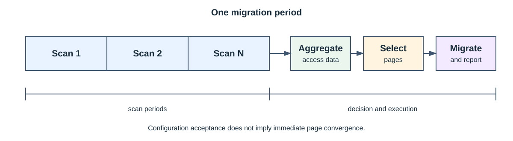

# SMAP

[简体中文](README.md) | [English](README_EN.md)

SMAP 是 UBTurbo 集成的多级内存扫描与页面迁移组件。它由 `libsmap.so` 用户态库以及扫描、迁移内核
模块组成，支持 4K 普通进程和 2M 静态大页虚机场景。

## 核心能力

- 使用 Linux 页表 Access Flag 进行软件访问扫描。
- 在配套硬件上选择性使用 HIST 进行远端页面访问统计。
- 根据本地冷页和远端热页选择迁移对象。
- 配置进程迁出比例/容量、迁回、紧急迁出和远端到远端迁移。
- 支持多个本地、远端 NUMA 目标和组级迁移策略。

软件 AF 扫描是可用的基础路径；HIST 是依赖特定平台的可选增强，不能将两者描述为所有环境都存在
的“软硬件协同必选流程”。

## 🏗️ 架构


| 层次             | 职责                                   |
| ---------------- | -------------------------------------- |
| 调用方           | 设置页面类型、PID、NUMA 容量和迁移目标 |
| 用户态管理与策略 | 管理生命周期、配置、冷热数据和迁移决策 |
| 扫描驱动         | 进程跟踪、页表 AF 扫描和可选 HIST 统计 |
| 迁移驱动         | 页面迁出、迁回和远端到远端迁移         |



一个迁移周期包含一个或多个扫描周期。配置被接受不代表页面已经立即收敛到目标比例；PID 退出、
页面被固定、容量变化和 NUMA 下线都可能产生部分成功。

## 🚀 构建与使用

用户态库：

```bash
cd plugins/smap
./build.sh -t release
```

内核模块：

```bash
cd plugins/smap
make -C src/drivers KERNEL_VERSION=openeuler -j"$(nproc)"
cp -f src/drivers/Module.symvers src/tiering/depends/
make -C src/tiering KERNEL_VERSION=openeuler -j"$(nproc)"
```

内核模块的安装、加载参数、加载顺序和卸载方法统一参见
[UBTurbo 安装指南](../installation.md#安装-smap)。

`ubturbo_smap_start` 的 `pageType` 为 `0` 时使用 4K 普通页面，为 `1` 时使用 2M 静态大页；同一实例
不得混用。典型流程为启动 SMAP、设置远端容量、添加 PID 或配置迁出目标、查询结果、移除 PID 并停止
SMAP。完整接口见 [API 参考](api_reference.md)。

内核开发包必须与运行内核匹配。

## 📌 常见问题

| 现象         | 检查项                              |
| ------------ | ----------------------------------- |
| 模块格式错误 | 运行内核与`kernel-devel` 是否一致 |
| 设备打开失败 | 模块顺序、udev 规则和运行用户权限   |
| 页面类型冲突 | 已有实例和共享状态中的`pageType`  |
| 扫描无数据   | PID、页型、扫描方式和平台能力       |
| 迁移量不足   | 可迁页面、远端容量、NUMA 状态和阈值 |

## 📑 文档

- [API 参考](api_reference.md)
- [算法设计](performance_algorithm.md)
- [性能测试指南](performance_testing.md)
- [发布说明](release_notes.md)

## ⚠️ 约束

- 仅支持 aarch64 Linux/openEuler 目标环境。
- 内核模块、内核开发包、用户态库和运行内核必须配套。
- `pageType` 在 `ubturbo_smap_start` 时确定；同一实例中的后续调用必须匹配。
- PID 和 NUMA 信息必须由可信调用方提供，SMAP 不承担租户授权。

## 📜 许可证

用户态与内核态文件的许可条款可能不同，分发时应保留源码头和
[Third Party Notice](<../../plugins/smap/License/Third Party Open Source Software Notice.md>)。
