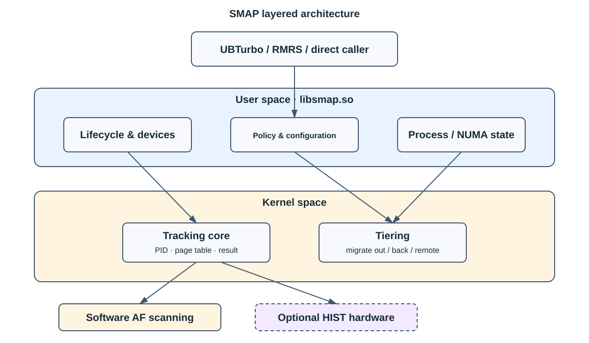

# SMAP

[简体中文](README.md) | [English](README_EN.md)

SMAP is the tiered-memory scanning and page-migration component integrated by UBTurbo. It consists of the
`libsmap.so` user-space library and kernel modules for access tracking and migration. It supports ordinary 4 KiB
process pages and virtual machines backed by static 2 MiB huge pages.

## Capabilities

- Software access tracking based on Linux page-table Access Flags.
- Optional HIST-based remote-page access statistics on supported hardware.
- Selection and exchange of local cold pages and remote hot pages.
- Migrate-out targets, migrate-back, urgent migration, and remote-to-remote migration.
- Multiple local and remote NUMA nodes and grouped migration policy.

Software AF scanning is the baseline path. HIST is an optional platform-specific enhancement and is not a required
part of every deployment.

## Architecture



The detailed architecture and operating notes are maintained in the synchronized [Chinese entry](README.md).

## Build

```bash
cd plugins/smap
./build.sh -t release
make -C src/drivers KERNEL_VERSION=openeuler -j"$(nproc)"
cp -f src/drivers/Module.symvers src/tiering/depends/
make -C src/tiering KERNEL_VERSION=openeuler -j"$(nproc)"
make -C src/ucache -j"$(nproc)"
```

Kernel development files must match the running kernel. See the [Chinese entry](README.md) for module loading and
troubleshooting.

## Documentation

- [API reference](api_reference.md)
- [Algorithm design](performance_algorithm.md)
- [Performance testing](performance_testing.md)
- [Release notes](release_notes.md)

Detailed documents are maintained in Chinese; this README is the synchronized English entry.
