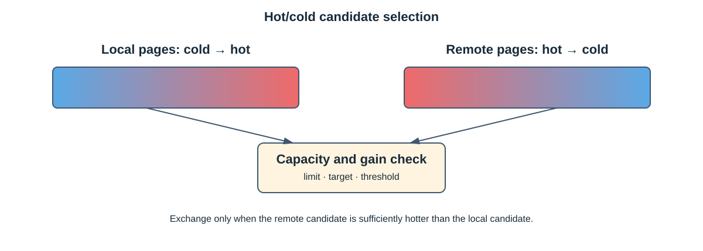
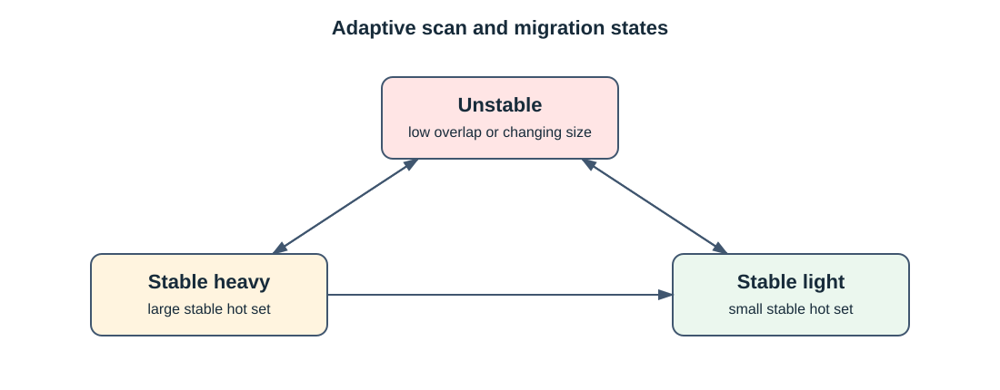
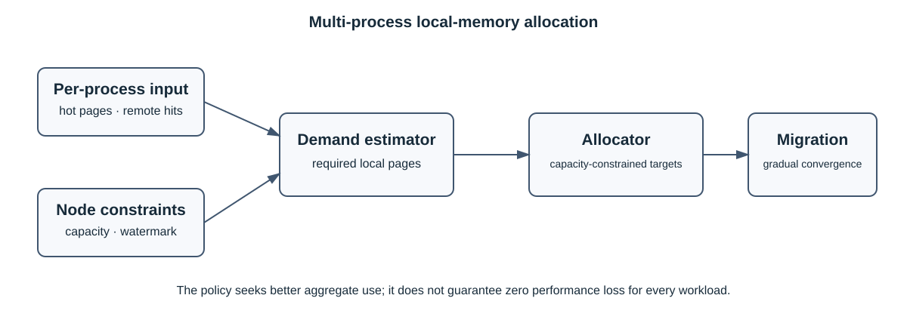
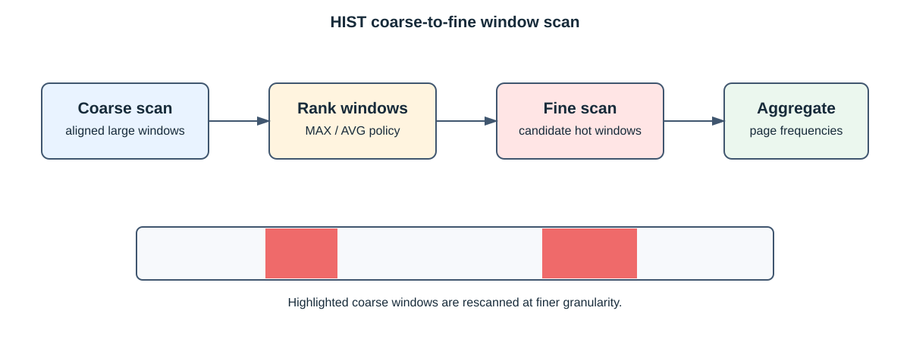

# 🧠 SMAP 策略与算法设计

## 文档边界

本文描述当前源码能够对应的算法结构，不给出缺少原始数据、测试环境和复现脚本的性能结论。旧文档
中的 97.41% 命中率、虚机混部曲线和 Stream 调度曲线因证据不足，不再作为项目性能声明。

## 冷热页面选择

一个迁移周期内可包含多次扫描。策略汇总页面访问结果后：

1. 对本地页面按访问频率从低到高排序，得到冷页候选。
2. 对远端页面按访问频率从高到低排序，得到热页候选。
3. 根据本地/远端可用容量、目标比例和单周期迁移上限确定最大交换量。
4. 比较候选页面的频率收益；收益不足时不交换，避免只产生迁移开销。
5. 将确定的页面交给内核迁移模块执行。

软件扫描和 HIST 的计数尺度可能不同，策略必须先使用当前实现规定的权重或归一化方法，不能直接将
两个原始计数比较为同一单位。

## 自适应周期

策略根据相邻迁移周期的热页数量变化和热区重合度区分非稳态、稳态重载和稳态轻载。非稳态需要更
及时的扫描；稳态场景可降低频率以减少页表扫描和迁移开销。

具体阈值和周期来自 `period.config` 及当前策略实现。文档不承诺所有负载都能自动达到最佳参数。

## 多进程资源比例

资源分配策略以各进程热页、远端热页、当前近端比例和可用容量为输入，计算需要保障的本地页面量。
历史文档中的固定系数和公式只有在源码仍使用同一实现时才可作为实现细节；调用方不应依赖未公开为
API 或配置的常量。

调度目标是把有限的近端内存优先分给收益更高的工作负载，而不是保证任意虚机“性能不下降”。实际
收益取决于工作集、扫描误差、迁移成本和硬件拓扑。

## HIST 多粒度滑窗

HIST 统计表项数量有限。2M 页面场景按较大对齐窗口扫描；4K 页面场景可以先使用粗粒度发现候选热区，
再切换到细粒度扫描候选窗口。窗口大小、计数器位宽和筛选比例属于硬件及实现约束，应以目标平台
源码和硬件资料为准。

HIST 不可用时，SMAP 使用软件 AF 路径，不应因为缺少硬件扫描而拒绝所有扫描功能。

## 正确性与开销

- 扫描周期越短，信息越及时，但 CPU、页表遍历和同步开销越高。
- 迁移周期越短，收敛更快，但数据复制、锁竞争和业务抖动风险更高。
- 页面被固定、进程退出、容量变化或拓扑变化会导致迁移部分成功。
- 频率相近的冷热页面可能没有足够交换收益，应由阈值抑制。

性能验证方法见[性能测试指南](performance_testing.md)。
