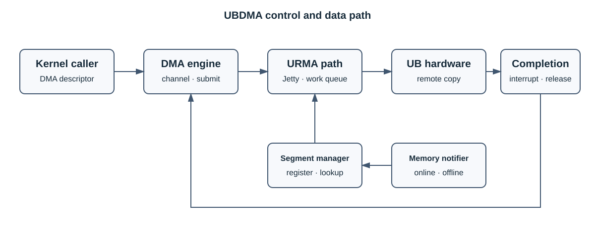

# UBDMA

UBDMA 是面向 UB/URMA 平台的数据搬移内核组件。它接收 DMA 描述符，管理已注册的内存 segment，
通过 URMA Jetty 和工作队列提交请求，并在完成路径中释放相关资源。

> [!IMPORTANT]
> UBDMA 依赖目标平台提供的 UB/URMA 能力，内核模块必须与运行内核和平台 SDK 配套。

## 🧩 核心能力

- DMA 通道创建、请求提交和完成回调。
- URMA segment 注册、查询与注销。
- 内存上下线事件处理。
- 通过 UB 硬件执行远端数据搬移。

## 🏗️ 架构



| 模块 | 职责 |
| --- | --- |
| DMA engine adapter | 通道申请、描述符准备、提交和完成回调 |
| URMA transport | Jetty、工作队列和远端传输 |
| segment manager | 注册、查询和注销 URMA segment |
| memory notifier | 在内存上下线时同步 segment 生命周期 |

## 🚀 安装与验证

```bash
rpm -qpi <UBDMA_RPM>
sudo rpm -Uvh <UBDMA_RPM>
find /lib/modules -path '*/ub_dma/ub_dma.ko' -print
sudo insmod <实际查询到的模块路径>
lsmod | grep '^ub_dma'
```

模块出现在 `lsmod` 中只表示初始化完成，还应验证 URMA 链路、segment 注册、DMA 完成回调和数据
一致性。卸载前停止所有使用者并等待在途请求完成，再执行 `sudo rmmod ub_dma`；返回 busy 时不得强制
卸载。

## 📌 常见问题

| 现象 | 检查项 |
| --- | --- |
| 找不到 URMA 头文件 | 内核开发包和平台 SDK |
| `invalid module format` | 模块是否针对当前内核构建 |
| segment 注册失败 | 地址范围、内存状态、权限和重复注册 |
| DMA 请求不完成 | Jetty、工作队列、中断和硬件链路 |

## 📑 文档

- [UBTurbo 安全说明](../security.md)

## ⚠️ 约束

- 仅在具备配套 UB/URMA 能力的平台上使用。
- 不得强制加载与当前内核不匹配的模块。
- 卸载前必须停止使用者并等待所有在途 DMA 请求完成。

## 📜 许可证

许可条款见仓库根 [LICENSE](../../LICENSE) 及相关源码文件头。
