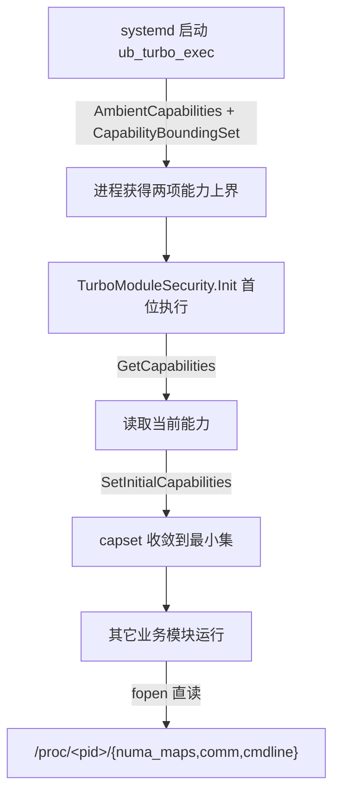

# ubturbo 提权方式改造说明：从 sudo cat.sh 到 Linux capabilities

> 本文档描述 ubturbo 读取受保护进程 `/proc/<pid>/*` 的提权方式改造：**改造前后的异同** 与 **当前的权限控制方案**。
> 改造目标是对齐 ubs-engine（`ubse.service` + `security` 模块）的能力（capability）方案，彻底移除 `sudo /usr/local/bin/cat.sh` 辅助脚本。

---

## 一、改造前后对比

### 1.1 提权机制总览

| 维度 | 改造前（sudo cat.sh） | 改造后（Linux capabilities） |
|---|---|---|
| 提权入口 | `sudo /usr/local/bin/cat.sh <pid> [file]` 外部脚本 | 进程内直读 `/proc/<pid>/*`，无外部脚本 |
| 权限来源 | root 拥有的 `cat.sh`（mode 500）+ 免密 sudoers | systemd 授予进程能力 + 进程内收敛 |
| 所需特权 | 完整 root（通过 sudo 提权执行 cat） | 仅 `CAP_DAC_READ_SEARCH` + `CAP_SYS_PTRACE` |
| 进程模型 | `popen()` 派生子进程执行脚本 | `fopen()` 直接打开文件，无子进程 |
| 依赖项 | sudo、bash、`/usr/bin/cat`、sudoers 配置 | 无（仅内核 capability 机制） |
| 权限校验 | 脚本首行输出 `UID=0, EUID=0`，代码校验该行 | 无需校验，直读成功即代表有权限 |
| 攻击面 | root 脚本 + 免密 sudo + 命令拼接 | 无脚本、无 sudo、无命令拼接 |

### 1.2 systemd 服务配置对比（`build/rpm/ubturbo.service`）

```diff
  User=ubturbo
  Group=ubturbo
  ExecStart=/opt/ubturbo/bin/ub_turbo_exec
- NoNewPrivileges=no
- AmbientCapabilities=
+ NoNewPrivileges=yes
+ AmbientCapabilities=CAP_DAC_READ_SEARCH CAP_SYS_PTRACE
+ CapabilityBoundingSet=CAP_DAC_READ_SEARCH CAP_SYS_PTRACE
  MemoryMax=30G
  RuntimeDirectory=ubturbo
```

| 配置项 | 改造前 | 改造后 | 说明 |
|---|---|---|---|
| `NoNewPrivileges` | `no` | `yes` | sudo 路径已移除，禁止进程及子进程获取新特权 |
| `AmbientCapabilities` | 空 | `CAP_DAC_READ_SEARCH CAP_SYS_PTRACE` | 以 `ubturbo` 非 root 用户启动时保留这两项能力 |
| `CapabilityBoundingSet` | 未设置 | `CAP_DAC_READ_SEARCH CAP_SYS_PTRACE` | 限定能力上界，进程无法获得此集合之外的任何能力 |
| `User`/`Group` | `ubturbo` | `ubturbo`（不变） | 仍以非 root 专用账户运行 |

### 1.3 RMRS 读取路径对比（`plugins/rmrs/.../rmrs_os_helper.cpp`）

**改造前** `ReadNumaMap()`：
1. 用 `snprintf_s` 拼接命令 `sudo /usr/local/bin/cat.sh <pid> 2>&1`
2. `ExecCommand()` 内 `popen()` 派生子进程执行脚本，`fgets` 逐行读取，`pclose()` 关闭
3. `checkUidEuid()` 校验首行是否为 `UID=0, EUID=0`，否则判定提权失败返回 `RMRS_ERROR`

**改造后** `ReadNumaMap()`：
1. 直接拼接路径 `/proc/<pid>/numa_maps`
2. 调用 `RmrsFileUtil::GetFileInfo(path, lines)` 进程内直读
3. 拼接 `lines` 为 `fileContent` 返回，保持原有按行解析契约不变

**被删除的代码**：
- 常量：`CMD_BUFFER_SIZE`、`CAT_SCRIPT_CAT_PATH`、`CAT_SCRIPT_TAIL`、`UID_EUID_ZERO`
- 函数：`ExecCommand()`、`checkUidEuid()`（含 `.h` 中声明）
- 头文件：`<array>`、`securec.h`（不再需要）

### 1.4 SMAP 读取路径对比（`plugins/smap/src/user/manage/manage.c`、`oom_migrate.c`、`smap_env.h`）

| 函数 | 改造前 | 改造后 |
|---|---|---|
| `GetPidTypeFromComm` | `popen("sudo cat.sh <pid> comm")` | `fopen("/proc/<pid>/comm", "r")` |
| `ReadCmdlineByPid` | `popen("sudo cat.sh <pid> cmdline")` + **跳过首行(UID 行)** | `fopen("/proc/<pid>/cmdline", "r")`，**直接读取**（无 UID 前缀行） |
| `OpenNumaMaps` | `popen("sudo cat.sh <pid> numa_maps")` | `fopen("/proc/<pid>/numa_maps", "r")` |
| 文件关闭 | 所有 `pclose(fp)` | 全部改为 `fclose(fp)` |

**关键点**：
- `ReadCmdlineByPid` 原先需 `fgets(skip,...)` 跳过脚本输出的 `UID=..., EUID=...` 首行；直读 `/proc` 后无此前缀行，故删除跳过逻辑，直接读取 cmdline 内容。
- `smap_env.h` 删除宏 `CAT_SCRIPT_CAT_PATH`、`CAT_SCRIPT_TAIL`。
- **保持不变**：`smap_interface.c` 的 `popen("numastat -cvm")`（非提权路径，numastat 为普通程序，`NoNewPrivileges=yes` 下不受影响）。

### 1.5 打包 / 安装对比

| 文件 | 改造前 | 改造后 |
|---|---|---|
| `build/rpm/cat.sh` | 存在（42 行脚本） | **已删除** |
| `CMakeLists.txt` | `install(PROGRAMS .../cat.sh DESTINATION bin)` | 已移除该安装规则 |
| `ubturbo.spec` | `%install` 安装 cat.sh、`%files` 列出 cat.sh、`%post` 含 `chmod_cat_sh()` | 全部移除 |
| `build/rpm/post_install.sh` | `chmod_cat_sh()`：拷贝到 `/usr/local/bin`、`chmod 500`、`chown root:root` | 已删除该函数及 `main()` 中调用 |
| `build/rpm/pre_uninstall.sh` | 无 cat.sh 清理 | **新增** `remove_file_if_exists "/usr/local/bin/cat.sh"` 清理历史遗留 |

### 1.6 相同点（保持不变的部分）

- **运行账户**：仍以专用非 root 账户 `ubturbo:ubturbo` 运行守护进程。
- **业务逻辑**：`numa_maps`/`comm`/`cmdline` 的解析逻辑、按行处理契约、返回值语义（如 `RMRS_ERROR`）完全不变。
- **读取目标**：仍是同一批 `/proc/<pid>/{numa_maps,comm,cmdline}` 文件，只是访问方式改变。
- **非提权路径**：`numastat`、`system("tar")` 等普通程序调用不受影响。
- **调用方**：`GetInfoFromNumaMaps`/`GetVmPageSizeFromNumaMaps` 等上层调用无需改动。

---

## 二、当前权限控制方案

改造后采用 **systemd 授权 + 进程内收敛** 的双层最小权限设计（对齐 ubs-engine）。

### 2.1 双层设计总览



- **第一层（systemd）**：`ubturbo.service` 通过 `AmbientCapabilities` 授予、`CapabilityBoundingSet` 限定能力上界为 `{CAP_DAC_READ_SEARCH, CAP_SYS_PTRACE}`，并以 `NoNewPrivileges=yes` 禁止后续获取新特权。
- **第二层（进程内）**：`TurboModuleSecurity` 在启动时通过 `capset` 系统调用将进程能力主动收敛到最小集，确保即使环境授予更多能力也不会被使用。

### 2.2 能力集及用途

| Capability | 用途 |
|---|---|
| `CAP_DAC_READ_SEARCH` | 绕过 DAC 文件权限校验，读取其他 uid 拥有的 `/proc/<pid>/*`（这些文件通常为 mode `0400`，属主为目标进程 uid） |
| `CAP_SYS_PTRACE` | 绕过 ptrace 访问校验，读取 `/proc/<pid>/numa_maps`、`smaps`、`maps` 等受 ptrace 保护的敏感信息 |

> 目标进程（如 qemu 虚机）与守护进程（ubturbo）属不同 uid，故需这两项能力配合才能读取受保护的 `/proc/<pid>/*`。

### 2.3 进程内安全模块收敛流程

模块位于 `src/security/`，作为 `TurboModule` 置于 `g_modules` **首位**（在其它所有模块之前初始化）：

- `src/include/turbo_module_security.h`：`class turbo::security::TurboModuleSecurity : public TurboModule`
- `src/security/turbo_module_security.cpp`：`Init()` 调用 `SetMinCapabilities()`
- `src/security/turbo_security_manager.cpp`：能力管理实现

`Init()` 执行顺序：
1. `GetCapabilities()`：`syscall(SYS_capget)` 读取当前能力（**必须先获取一次，否则无法成功设置**）。
2. `SetInitialCapabilities()`：`syscall(SYS_capset)` 将 `permitted` + `effective` 设置为 `{CAP_DAC_READ_SEARCH, CAP_SYS_PTRACE}`。

实现要点：
- 使用 `_LINUX_CAPABILITY_VERSION_3`、`__user_cap_data_struct[2]`（覆盖 64 位能力）、`CAP_TO_INDEX`/`CAP_TO_MASK` 宏。
- `memset_s` 清零能力数据结构，`std::nothrow` 分配并成对 `delete[]` 释放，失败返回 `TURBO_ERROR` 并记录错误。

```cpp
// src/main/turbo_main.cpp —— security 置于 g_modules 首位
const std::vector<std::shared_ptr<TurboModule>> g_modules = {
    std::make_shared<turbo::security::TurboModuleSecurity>(), // 先收敛能力
    std::make_shared<turbo::config::TurboModuleConf>(),
    std::make_shared<turbo::log::TurboModuleLogger>(),
    std::make_shared<turbo::smap::TurboModuleSmap>(),
    std::make_shared<turbo::plugin::TurboModulePlugin>(),
    std::make_shared<turbo::ipc::server::TurboModuleIPC>()};
```

### 2.4 直读路径

收敛完成后，业务模块通过标准文件 I/O 直接读取，不再派生任何子进程：

| 组件 | 读取方式 | 目标文件 |
|---|---|---|
| RMRS | `RmrsFileUtil::GetFileInfo(path, lines)` | `/proc/<pid>/numa_maps` |
| SMAP | `fopen(path, "r")` + `fgets` + `fclose` | `/proc/<pid>/{numa_maps,comm,cmdline}` |

### 2.5 最小权限原则体现

- **能力最小化**：仅保留读取 `/proc` 所必需的两项能力，去除了 ubs-engine 中 ubturbo 不需要的 `CAP_SYS_NICE`/`CAP_FOWNER`/`CAP_CHOWN`/`CAP_DAC_OVERRIDE`/`CAP_AUDIT_WRITE`/`CAP_NET_ADMIN`。
- **非 root 运行**：守护进程以专用账户 `ubturbo` 运行，不再借助 root。
- **禁止提权升级**：`NoNewPrivileges=yes` 保证进程及其子进程无法通过 execve、setuid 等方式获取新特权。
- **能力上界锁定**：`CapabilityBoundingSet` 从系统层面限定进程永远无法获得集合外的能力。

### 2.6 相比改造前的安全性提升

| 提升点 | 说明 |
|---|---|
| 消除 root 脚本 | 删除 mode 500、root 拥有的 `cat.sh`，去除高危提权入口 |
| 消除免密 sudo | 无需配置 `/etc/sudoers.d/ubturbo`，去除 sudo 免密风险 |
| 消除命令拼接 | 不再拼接 shell 命令字符串，杜绝命令注入面 |
| 消除子进程 | `popen` → `fopen`，无进程派生，降低开销与竞态 |
| 特权精细化 | 从"完整 root"收敛为"两项只读相关能力"，符合最小权限 |
| 双重收敛 | systemd 授权 + 进程内 capset 主动收敛，纵深防御 |

---

## 三、相关文件清单

**新增**：
- `src/include/turbo_module_security.h`
- `src/security/turbo_security_manager.h`
- `src/security/turbo_security_manager.cpp`
- `src/security/turbo_module_security.cpp`
- `src/security/CMakeLists.txt`

**修改**：
- `build/rpm/ubturbo.service`（能力配置）
- `src/main/turbo_main.cpp`（security 模块置首位）
- `src/CMakeLists.txt`（接线 security 子目录）
- `plugins/rmrs/.../rmrs_os_helper.cpp` / `.h`（直读 numa_maps）
- `plugins/smap/src/user/manage/manage.c`、`oom_migrate.c`、`smap_env.h`（popen→fopen）
- `CMakeLists.txt`、`ubturbo.spec`、`build/rpm/post_install.sh`、`build/rpm/pre_uninstall.sh`（打包）
- 测试：`plugins/smap/test/user/manage/test_manage.cpp`、`test_oom_migrate.cpp`
- 文档：`doc/ubturbo_security_description.md`、`doc/Tutorial.md`、`doc/ubturbo_installation.md`、`plugins/smap/doc/User_Guide.md`

**删除**：
- `build/rpm/cat.sh`
