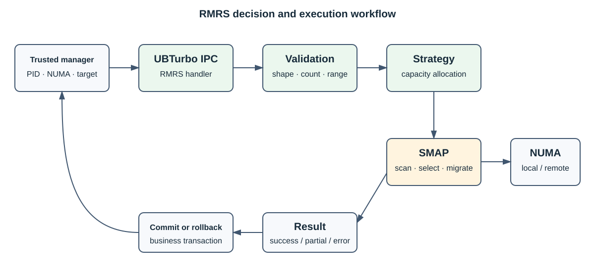

# RMRS

[简体中文](README.md) | [English](README_EN.md)

RMRS 是运行在 UBTurbo 守护进程中的资源迁移与调度插件。它面向虚机和容器场景，根据业务请求、
NUMA 容量及页面冷热信息计算迁移方案，并通过 SMAP 执行迁出、迁回和回滚。

## 核心能力

- 计算多个进程或虚机的内存迁出策略。
- 执行迁出，并在业务失败时回滚已借用内存。
- 判断远端内存能否归还并执行迁回。
- 采集进程/NUMA 内存信息。
- 按配置接入 UCache 页面缓存迁移路径。

RMRS 不直接迁移物理页面，也不校验 PID 的业务所有权。页面扫描与迁移由 SMAP 完成，PID 与 NUMA
信息必须由可信资源管理系统下发。

## 架构



详细流程见[架构设计](docs/architecture.md)。

## 构建与启用

RMRS 由顶层构建统一编译：

```bash
cd ../..
git submodule update --init --recursive
./build.sh
```

启用前确认 `librmrs_ubturbo_plugin.so` 和 `plugin_rmrs.conf` 已安装，然后编辑
`/opt/ubturbo/conf/ubturbo_plugin_admission.conf`：

```ini
rmrs=777
```

重启 UBTurbo 后检查日志，确认 RMRS 所有 IPC 服务注册成功。

## 文档

- [用户指南](docs/user_guide.md)
- [架构设计](docs/architecture.md)
- [API 参考](docs/api_reference.md)
- [UBTurbo 配置参考](../../docs/configuration.md)
- [安全说明](../../docs/security.md)

## 许可证

见仓库根 [LICENSE](../../LICENSE) 及本组件随附许可证文件。
