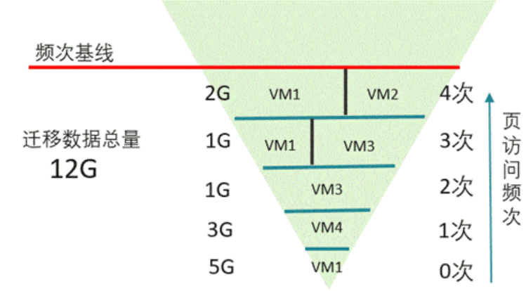
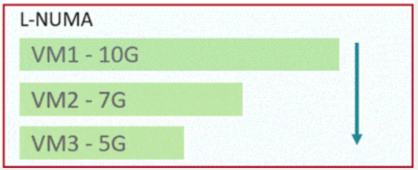
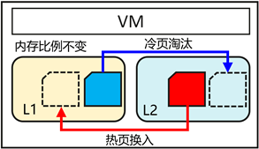

# Summary

RMRS(Rack Memory Resource Schedule)（UBTurbo-RMRS插件）是一款Huawei计算产品线自研, 开源的内存迁移工具, 是ubturbo框架的插件，其搭配OBMM、底层调用SMAP使用，可以决策及执行将虚拟机的内存迁出到远端以及决策、执行将内存迁回.

- 提供内存迁移策略、内存迁移执行、内存迁回、节点/进程内存信息采集、pagecache迁移执行的功能
- 面向灵衢架构的通算虚拟化场景
- 是UBTurbo中的一个组件，依赖SMAP

# Usage Example

- [API文档](./docapi_docs_reference.md)
- [用户指南](./User_Guide.md)

# Movitvation

RMRS基于OBMM提供的内存借用、归还功能，SMAP提供的冷热识别、内存迁移功能，统一对虚拟化组件提供内存管理能力。

内存碎片场景，RMRS部署在各计算节点的OS Turbo内，基于自身的资源采集，提供碎片场景虚机的迁出/迁回策略，利用SMAP迁移能力执行虚机的迁出和迁回。

虚机超分场景，MemLink动态回收虚机的空余内存或补充内存。在numa内存触发高水位水线时，触发内存借用，并迁出虚机内存，缓解内存压力。在numa内存触发低水位水线时，归还借用内存。

# Detailed Design

RMRS面向虚拟化场景，包括内存碎片、内存超分、容器超分场景，统一对虚拟化组件提供内存管理能力。

1、内存碎片场景--内存迁移决策

（1）迁移数据虚机的冷热数据，根据迁出总量确定页访问频次基线，以及各虚机数据迁出比例。

（2）虚机实际迁出数据比例 = min(最大迁出比例，步骤1计算比例）虚机剩余可迁出内存 = 虚机内存规格 * （最大迁出比例 – 步骤1迁出比例），将虚机剩余可迁出内存按照大小降序排列，继续迁出达到数据迁出总量。

2、内存碎片场景--内存迁移执行、内存迁回、内存迁移回滚

内存迁移执行、内存迁回、内存迁移回滚底层都是调用SMAP迁移执行接口。首先每个 VM 使用轻量级线程周期性扫描自己的页面，识别访问频繁页（SMAP项目研究了基于硬件的判热与判冷技术，硬件判热技术已落入1650芯片的UB union die；判冷技术当前基于Linux内核页表采用软件实现，计划落入到后续1650版本。由硬件来识别难度更高的远端内存中最热的部分页面，软件来识别统计难度较低的近端内存中最冷的部分页面。）。然后进行冷热页分类，判断页面在上一个周期内的访问频次并打标签（热页、冷页、中性页）。最后执行页迁移，将热页迁回本地 DRAM，冷页迁出到远端内存。

# Design constraints

RMRS使用有以下约束或限制：

- 需要服务器使用灵衢架构，依赖OBMM
- 是UBTurbo框架的一个插件，依赖UBTurbo
- 面向虚拟化场景，依赖libvirt
- 只支持管理使用2M静态大页的虚机或使用4K页面的进程

# Adoption strategy

- 应用无需做特殊更改

# Related Documentions

无

# SIGs/Maintianers

待补充