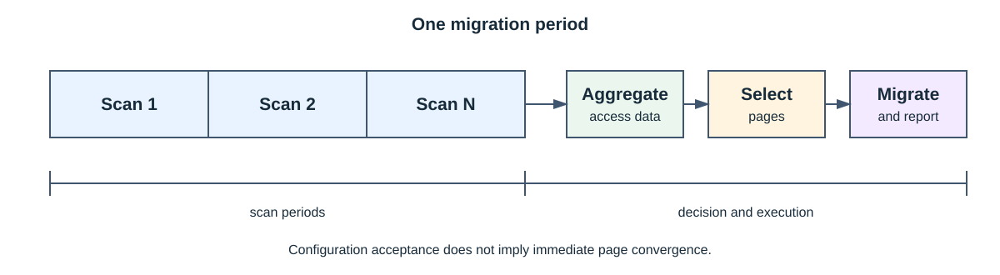

# SMAP 架构设计

## 组件边界

SMAP 横跨用户态和内核态：

| 层次 | 主要模块 | 职责 |
| --- | --- | --- |
| 调用方 | UBTurbo、RMRS 或直接集成方 | 设置页面类型、PID、NUMA 容量与迁移目标 |
| 用户态管理 | `manage/` | 生命周期、设备、线程、配置和进程状态 |
| 用户态策略 | `strategy/`、`advanced-strategy/` | 页面冷热整理、迁移决策和资源比例调整 |
| 扫描驱动 | `drivers/` | 进程跟踪、页表扫描、HIST 控制和结果导出 |
| 迁移驱动 | `tiering/` | 页面迁出、迁回及远端到远端迁移 |
| UCache 驱动 | `ucache/` | 页面缓存迁移 |

## 扫描路径

### 软件扫描

软件路径遍历目标进程页表并读取 Access Flag。扫描周期内访问过的页面被记录，然后按当前策略清理或
更新状态，为下一周期提供差异。它不要求 HIST 硬件，但会产生页表遍历和 TLB 相关开销。

### HIST 硬件扫描

在支持的硬件上，HIST 对配置的物理地址窗口累计访问计数。一次可覆盖的地址范围取决于统计粒度，
用户态策略通过滑动窗口组织扫描。该路径是可选增强；驱动存在不代表目标机器具备对应硬件能力。

## 扫描与迁移周期

一个迁移周期包含一个或多个扫描周期。用户态汇总扫描结果，对本地页面按冷到热排序、远端页面按热
到冷排序，再结合容量、目标比例和收益阈值形成迁移任务。扫描完成不等于迁移完成。

## 迁移模型

- 普通迁出：为 PID 配置远端目标，SMAP 根据页面驻留和 CPU affinity 管理本地来源。
- 分组迁出：显式描述 local/remote 分组，仅支持接口声明的页面类型和上限。
- 迁回：将指定远端 NUMA 上的进程页面迁回本地。
- 远端迁移：在两个远端 NUMA 之间迁移容量，可按 NUMA 或 PID 过滤。
- 紧急迁出：在本地内存压力下触发额外迁出，不替代常规容量管理。

普通迁出请求会更新 PID 的目标配置。容量不足时目标可被保存，但页面只能按当时可用容量逐步收敛；
调用方不能把“配置已接受”解释为“迁移目标已立即达成”。

## 多 NUMA

同一 PID 可跨多个本地 NUMA 驻留，并配置多个远端 NUMA。用户态维护进程配置和迁移记录，内核执行
实际页面移动。多个本地节点共享同一远端目标时，如果无法可靠判断页面来源，策略会跳过可能错误的
冷热交换，同时仍处理明确的迁出或迁回需求。

## 并发与失败

- 生命周期、扫描配置和迁移任务使用互斥、原子变量及内核锁保护。
- 同步迁出等待任务完成或超时；`maxWaitTime=0` 表示无限等待，非零超时不保证内核中不存在仍在收尾
  的工作，调用方应查询结果。
- PID 退出、页面被固定、容量变化和 NUMA 下线都可能产生部分成功。
- `ubturbo_smap_stop` 前应停止新增请求并等待调用者退出；卸载内核模块前必须停止所有 SMAP 进程。

## 安全边界

SMAP 只校验接口结构和可执行条件，不确认 PID 的租户归属。设备节点、配置文件和内核模块必须使用
最小权限，日志不得记录完整地址列表或页面内容。
