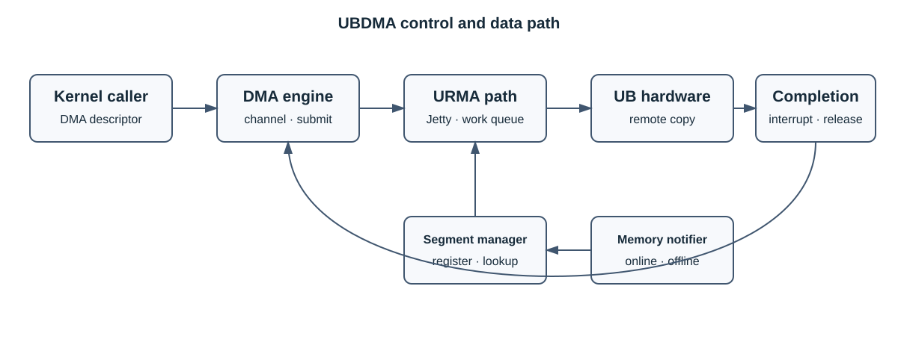

# UBDMA 架构设计

## 定位

UBDMA 是基于 Linux DMA engine 与 URMA 的内核组件，用于把远端内存复制从 CPU 路径卸载到 UB
硬件。它不是 UBTurbo 的 IPC 插件，也不负责决定哪些业务页面需要迁移。

## 组件

| 模块 | 职责 |
| --- | --- |
| DMA engine adapter | 通道申请、配置、描述符准备、任务提交和完成回调 |
| URMA transport | Jetty、工作队列及远端数据传输 |
| segment manager | 注册、查询和注销迁移内存对应的 URMA segment |
| memory notifier | 内存上线/下线时同步 segment 生命周期 |
| interrupt/completion | 处理完成事件并释放描述符和任务资源 |

## 数据流

1. 内核调用方通过 DMA engine 接口申请通道并提交复制请求。
2. UBDMA 根据地址查询已注册 segment，构造 URMA 工作请求。
3. 硬件执行远端复制并产生完成事件。
4. 完成路径更新 DMA 描述符状态、通知调用方并释放资源。

控制路径与数据路径必须分开理解：segment 注册和 Jetty 建立属于控制路径，实际内存数据由硬件通路
传输。

## 生命周期与并发

- 内存上线后才能注册并使用对应 segment；下线前必须阻止新增请求并等待在途任务结束。
- 描述符只能在完成或取消路径之一释放，避免重复释放。
- 中断上下文不得执行睡眠操作或无界等待。
- 模块退出时按任务、通道、Jetty、segment 的依赖关系清理。

## 安全边界

调用方必须保证源/目的地址、长度、远端节点和 segment 均已授权。UBDMA 不提供租户认证。内核模块、
设备和 URMA 配置应使用最小权限，日志不得打印完整内存内容或不必要的精确地址。
